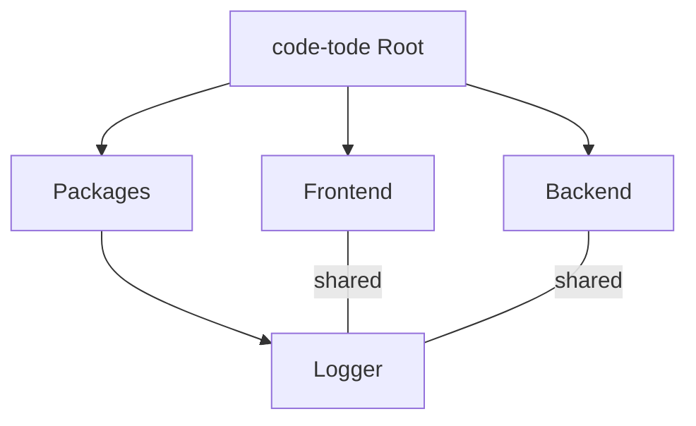

## Monorepo Structure Explained

Below is a visual representation of how the monorepo structure works, with the `logger` package being shared between the `frontend` and `backend` projects:



### Explanation

1. **Frontend**: The `frontend` project is responsible for the client-side application. It handles user interactions, displays data, and communicates with the backend. To maintain consistent logging across the application, the `frontend` imports the `logger` package. This ensures that all logs, whether for debugging or monitoring, follow a standardized format and can include features like colored console logs for better readability during development.

2. **Backend**: The `backend` project is responsible for the server-side logic, including handling API requests, processing data, and interacting with the database. Like the `frontend`, the `backend` also imports the `logger` package. This allows the backend to produce consistent and structured logs, which are crucial for debugging, monitoring server performance, and tracking errors in production environments.

3. **Packages/Logger**: The `logger` package is a shared utility within the monorepo, located in the `packages` folder. It encapsulates the logic for logging, such as formatting messages, adding timestamps, and applying colors to logs for better visibility. By centralizing this functionality in a shared package:
   - **Consistency**: Both the `frontend` and `backend` use the same logging logic, ensuring uniformity across the entire application.
   - **Reusability**: The `logger` package can be updated or extended in one place, and the changes will automatically propagate to both the `frontend` and `backend`.
   - **Maintainability**: Centralizing the logging logic reduces code duplication, making the codebase easier to maintain and less prone to errors.

This monorepo structure not only promotes code reuse but also simplifies dependency management. By sharing the `logger` package, the `frontend` and `backend` can focus on their core functionalities while relying on a robust and consistent logging solution. This approach enhances the scalability and maintainability of the overall project.

## Project Setup

The `logger` package will be a logging utility for both frontend and backend applications. It will help print logs in a consistent format with colors, both in the terminal (backend) and the browser (frontend). Here's how to set it up:

### Steps to Create the Logger Package

1. **Create the Folder**:
   Create a folder `packages/logger`.

2. **Initialize the Package**:
   Add a `package.json` file by running:

   ```bash
   npm init -y
   ```

3. **Add TypeScript Configuration**:
   Create a `tsconfig.json` file with the following content:

   ```json
   {
     "compilerOptions": {
       "target": "ES2020",
       "module": "NodeNext",
       "moduleResolution": "NodeNext",
       "esModuleInterop": true,
       "forceConsistentCasingInFileNames": true,
       "strict": true,
       "skipLibCheck": true,
       "declaration": true,
       "outDir": "./dist",
       "rootDir": "./src"
     },
     "include": ["src/**/*"],
     "exclude": ["node_modules", "dist"]
   }
   ```

4. **Create the Source File**:
   Inside the `logger` folder, create a `src` folder and add a file named `index.ts` with the following code:

   ```typescript title="/src/index.ts"
   export class Logger {
     private static colors = {
       red: "\x1b[31m",
       green: "\x1b[32m",
       yellow: "\x1b[33m",
       blue: "\x1b[34m",
       magenta: "\x1b[35m",
       cyan: "\x1b[36m",
       gray: "\x1b[90m",
       reset: "\x1b[0m",
     };

     private static formatMessage(
       message: string,
       color: string,
       data?: any
     ): void {
       console.log(`${color}${message}${this.colors.reset}`, data || "");
     }

     static error(message: string, data?: any): void {
       this.formatMessage(message, this.colors.red, data);
     }

     static success(message: string, data?: any): void {
       this.formatMessage(message, this.colors.green, data);
     }

     static warning(message: string, data?: any): void {
       this.formatMessage(message, this.colors.yellow, data);
     }

     static info(message: string, data?: any): void {
       this.formatMessage(message, this.colors.blue, data);
     }

     static debug(message: string, data?: any): void {
       this.formatMessage(message, this.colors.magenta, data);
     }

     static log(message: string, data?: any): void {
       this.formatMessage(message, this.colors.cyan, data);
     }

     static optional(message: string, data?: any): void {
       this.formatMessage(message, this.colors.gray, data);
     }
   }
   ```

### Explanation of the Logger Class

The `Logger` class is a reusable utility designed to print colorful and organized messages to the console or terminal. Here's a breakdown of its key features:

1. **Static Methods and Properties**:

   - All methods and properties are static, meaning they belong to the class itself and can be accessed without creating an instance.
   - Example usage: `Logger.error("An error occurred!");`

2. **Color Codes**:

   - The `colors` property contains ANSI escape codes for different colors, used to style the console output.

3. **Format Message**:

   - The `formatMessage` method constructs the log message with the specified color and resets the color after the message.

4. **Logging Methods**:
   - Methods like `error`, `success`, `info`, etc., provide a simple interface for logging messages with predefined colors.

### Build and Use in Frontend and Backend Projects

1. **Add Build Script**:
   Since it's a TypeScript project, add a build script to compile the files. Update your `package.json` file with the following code:

   ```json
   {
     "name": "@packages/logger",
     "version": "1.0.0",
     "description": "Shared logger",
     // highlight-start
     "main": "dist/index.js",
     "module": "dist/index.mjs",
     "types": "dist/index.d.ts",
     "scripts": {
       "build": "tsup src/index.ts --format cjs,esm --dts",
       "dev": "tsup src/index.ts --format cjs,esm --dts --watch"
     },
     // highlight-end
     "keywords": [],
     "author": "",
     "license": "ISC",
     "devDependencies": {
       "@types/node": "^24.2.1",
       "tsup": "^8.5.0",
       "typescript": "^5.9.2"
     }
   }
   ```

2. **Install Dependencies**:
   Install the required packages:

   ```bash
   pnpm install --save-dev @types/node tsup typescript
   ```

3. **Build the Package**:
   Run the following command to build the package:

   ```bash
   pnpm run build
   ```

   For live reload during development, use:

   ```bash
   pnpm run dev
   ```

4. **Add the Logger Package to Frontend and Backend**:
   In your frontend project:

   ```bash
   pnpm add @packages/logger --workspace
   ```

   In your backend project:

   ```bash
   pnpm add @packages/logger --workspace
   ```

5. **Use the Logger in Your Applications**:

   - **Backend**:

     ```typescript title="/backend/src/index.ts"
     // ... rest of your code
     public start(): void {
       this.app.listen(this.app.get("port"), () => {
        // highlight-next-line
        Logger.info(`API is running at http://localhost:${this.app.get("port")}`);
       });
     }
     // ... rest of your code
     ```

     Run the server:

     ```bash
     pnpm run dev
     ```

     You should see blue-colored log messages in the terminal indicating the server is running.

   - **Frontend**:

     ```typescript title="frontend/src/routes/index.tsx"
     import { Logger } from "@packages/logger";

     function App() {
       // highlight-next-line
       Logger.info("Frontend application is starting...");
       // rest of your code
     }
     ```

     Run the frontend:

     ```bash
     pnpm run dev
     ```

Open the browser and navigate to the url from terminal. Check the browser dev console to see the colorful log messages.

### Benefits of the Logger Package

- **Frontend**:

  - Simplifies debugging by providing clear, colorful logs in the browser console.
  - Ensures consistent log formatting across the application.
  - The `Logger.info` method is used to log the server's startup message. This ensures that the log is easily distinguishable in the terminal.

- **Backend**:
  - Helps monitor server activity and errors with structured logs.
  - Makes debugging easier by highlighting important messages with colors.
  - The `Logger.info` method logs the application's startup message, making it easier to trace the app's initialization process in the browser console.
