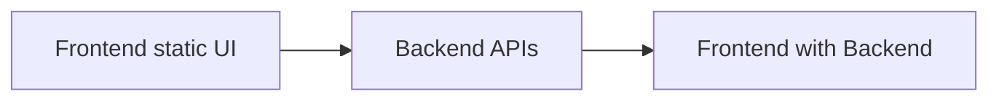

We will follow this flow throughout the course:

## Cleaning the Project

Navigate to `frontend/src` and delete the following files to clean up the project:

- `frontend/src/routes/index.tsx`
- `frontend/src/logo.svg`
- `frontend/src/styles.css`

This step removes the initial React starter UI files, giving us a clean slate to start building our application.

## Step 1: Set Up Tailwind CSS

Follow the [Tailwind CSS installation guide for Vite](https://tailwindcss.com/docs/installation/using-vite) to set up Tailwind CSS in your project. After installation:

- Update the `index.html` file to include the Tailwind CSS directives.
- Verify that Tailwind CSS is working correctly by testing some basic styles.
- Update the `vite.config.ts` and `styles.css` files to complete the setup.

With Tailwind CSS in place, we’re ready to create a modern and responsive UI.

## Setting Up the Authentication Layout

Create a new layout for the authentication pages of your website.

### Step 2: Create a Grouped Folder for Website Routes

- Navigate to `frontend/src/routes`.
- Create a folder named `(website)` (including the parentheses). This naming convention helps group the routes for the website.

### Step 3: Create a Layout Component

- Inside the `(website)` folder, create another folder named `_layout`.
- Inside the `_layout` folder, create a file named `index.tsx` to serve as the home page.
- Inside the `(website)` folder, create a file named `_layout.tsx`.

The `_layout.tsx` file will contain the layout UI code. All routes within the `(website)` folder will inherit this layout, ensuring a consistent structure across the website's pages.

### Step 4: Add Authentication Routes

- Create another folder named `(auth)` (including the parentheses) inside `frontend/src/routes`.
- Inside the `(auth)` folder, create the following files:
  - `signin.tsx`: This will serve as the sign-in route.
  - `github-callback.tsx`: This will handle the authentication process with GitHub.

By following these steps, you establish a clean and organized layout and routing structure for your website.

## Step 5: Create Our First Component

- Create a `components` folder in `frontend/src`.
- Organize components feature-wise into folders like `website`, `admin`, `learner panel`, `auth`, and `common` for shared components.
- Create the `navbar` component in `frontend/src/components/website/navbar.tsx`. This will be a pure component for the website’s navigation bar.
- Add the navbar to the layout and test the result.
- Create the `footer` component in `frontend/src/components/website/footer.tsx`. This will be a pure component for the website’s footer.

Explain the props for both components and how they can be reused across different pages using the TanStack layout.

## Step 6: Build the GitHub Authentication UI

- Create the UI for `github-callback.tsx`, a simple page for handling the loading process during sign-in or sign-up with GitHub.
- Add the sign-in page UI in `signin.tsx`.
- Create a reusable button component in `components/common/button.tsx` for GitHub authentication.
  - Install the `clsx` package to merge Tailwind CSS classes: `pnpm install clsx`.
  - Add the GitHub icon to the button using the `lucide-react` package: `pnpm install lucide-react`.
  - Explain the deprecation of GitHub icons and the compliance concerns.
  - Use an SVG generated from Gemini for the GitHub icon.

## Step 7: Add Navigation and Theme Changer

- Add navigation buttons to the navbar for the admin panel, courses, logout, and a theme changer button.
- As the theme changer will help to change the theme, let’s add our first hook for changing themes. It’s pretty easy as we are using Tailwind CSS.
- Create a `frontend/src/hooks` folder. Inside that, create a `ui` folder where all the UI-related hooks will be placed. Now, create a file named `useTheme.ts` inside the `ui` folder.
- This hook will handle the theme change functionality. It will toggle between light and dark themes using Tailwind CSS.
- Explain the hook and its use case.
- Explain why the buttons are static for now.
- Explain why you should not use my direct code often for learning purposes. Build it by yourself or ask Gemini—that’s the cool thing. Nowadays, UI is simple to generate. So, a simple story... yeah.

## Step 8: Implement Basic UI for Admin Panel and Learner Panel

- Make sure the image links you use? Follow latest code image url like: `https://placehold.co/400`
- This UI will be displayed after the user logs in. Admins will go to the admin page, and learners will go to the learner page.
- Let’s create folders similar to the website. In the `src/routes` folder, create two folders: one named `admin` and the other named `learner`. Since we are not using parentheses for these folders, they will be treated as regular routes.
- Both layouts will contain their own layout. So, we need to create a `_layout.tsx` file in both the `admin` and `learner` folders, and a `_layout` folder for all the routes for admin and learner.
- Inside the `_layout` folder, we can create any file, and it will work as a route. For this module, our goal is to create authentication, so we can create a simple profile page in both folders. Let’s work on the profile page.
- Create `profile.tsx` in both `_layout` folders in the admin and learner panels.
- Cool! Now we have profile page URLs like:
  - `/admin/profile`
  - `/learner/profile`
- Add the `<Outlet />` component in the `_layout.tsx` files for both the `admin` and `learner` folders to control the nested routes from the layout. Here, we can add the sidebar and common elements that will be inherited by all the routes.
- An important note: we have to add the `useTheme()` hook that we created so that it syncs with the theme, like the website. We can define it in the `_root.tsx` file, but it’s better to control it separately. Or, if you want, you can do that. The best practice is to add it to the `_root.tsx` file. I’m showing you this so you can understand that we have full control over each portion of the layout. If we declare it in the root, it will apply all over the application.
- Now we have theme sync. Let’s show that in the UI.
- Let’s create a layout for our admin and learner panels. It should be a common layout for both, containing the sidebar and content.
- Add a basic layout structure in both `layout.tsx` files for the admin and learner panels.
- Both will have the same structure and a sidebar, but with different menus.
- Create menu arrays with icons. We are going to pass them into the sidebar, and the sidebar will render those menus. Cool!
- We need a component for a common sidebar. Let’s create a `sidebar.tsx` file in the `frontend/src/components/common/layout` folder, as it’s part of the layout.
- Now use it in our layout and see the result.
- Explanation of the sidebar component, menu mapping, active menu logic, all with mobile responsiveness. Yeah...
- We can divide the sidebar component into multiple parts. As you can see, the component becomes big, more than 100 lines. So, we should break it down into more modular pieces for easier debugging.

Additionally, let’s add the profile page.

- Add a basic layout for the profile page.
- Since this profile page will be common for both admin and learner, we will just export our component.
- Reuse the same one in the learner profile page. That’s it. Now we will work on one, and it will work for both. If you need separation in the future, you can easily create separate components for learners or admins based on your requirements.
- Now it’s time to add our first form UI.

## Step 10: Before Using Forms, Set Up a Validation Library and Types

- We are going to use `zod` for validation. It’s a powerful and easy-to-use library for schema validation. We will reuse the same validation for both the frontend and backend.
- This will be another smaller package in our packages, where we will put all the validation types together so that they can be shared between the backend and frontend.
- We are going to name it `packages/definitions`.
  - Create the folder.
  - Take the same `package.json` and `tsconfig.json` files from our logger package.
  - Add a `src` folder.
  - Create `validations` and `types` folders inside the `src` folder, where we will write the types, validations, and zod schemas.
  - Create an `index.ts` file in the `src` folder and export all the types and validations from there.
  - Install the `zod` package into the `packages/definitions` folder as a dependency.
  - We will not use `zod` in the frontend or backend anymore. Instead, we will use the shared validation from the `packages/definitions` package.
  - Install all packages, as we copied the `package.json` file from our logger package.
  - The `ts up` script will help to build, as it’s the same script we used. Yeah, cool!
- Add the types for updating the profile. We will add more as we work on the backend and bind the backend with the frontend. For now, just the form validation for the profile. These two fields will be able to update, which is why we added two fields.
- Let’s check if we can import that successfully.
- First, install it by running `pnpm add @packages/definitions --workspace`.
- You should see the frontend `package.json` updated with the package. Now we can import it anywhere in our frontend. The same case will work exactly for the backend: first install it, and then use it anywhere in the backend.
- Trouble Shot: If you see the import is not working??
  - Make sure you have the correct path and the package is installed.
  - Check if the `tsconfig.json` is properly configured to include the package. That's need to be done. Add include paths for the package.
  - Restart your development server.

## Step 11: Create the Profile Form UI

- Create a `profileForm.tsx` component in the `frontend/src/components/common/admin` folder. As our main page was in the admin route so this form should belong into the admin component.
- As we are going to use `react-hook-form` for form handling so let's install it first. by `pnpm add react-hook-form`.
- So now we need add input field. But what if we make it a common input field for general use case? so let's make it on `frontend/src/components/common/input.tsx`.
- Explain the input field.
- Now let's try to bind the input field with the `react-hook-form` way in the `profileForm.tsx` file it self first.
- import schemas and types from `@packages/definitions` package. If import issue look into the `tsconfig.json` config for that.
- then make a controller for the `useProfileFormController` move the form logic there. submit handler and all of them explain and export.
- Toast uses added into `main.tsx` file and then use case.
- Use the hook controller in the component. Will explain why this is better approach to separate logic.
- Use the form in the ProfileForm Component.

Our Ui work is done for now! But will come back again after implementing the backend. then we will integrate our backend with the frontend.
