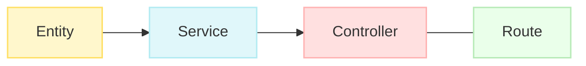
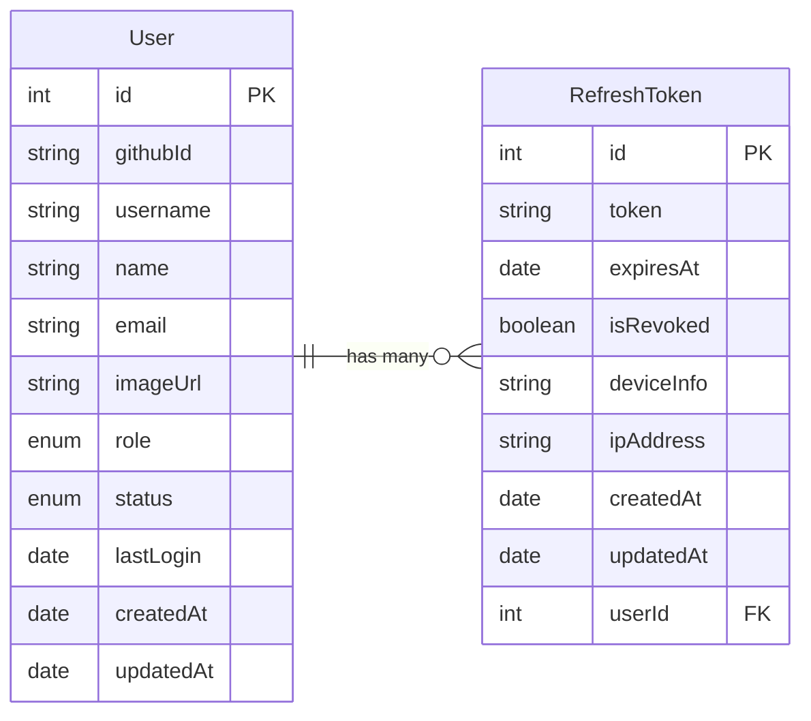
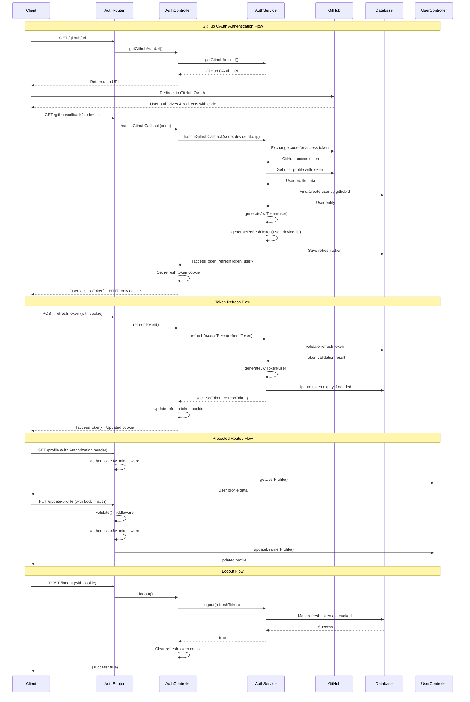
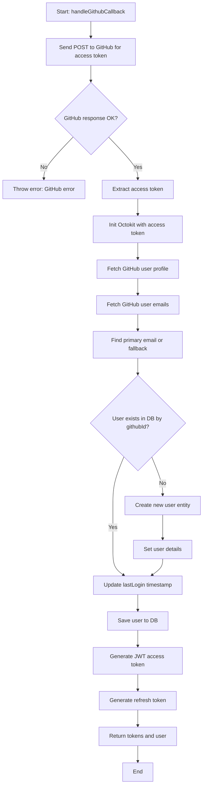
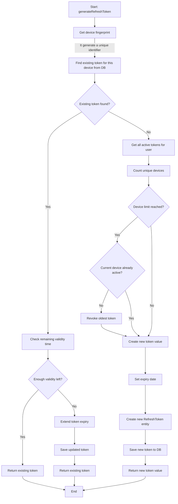
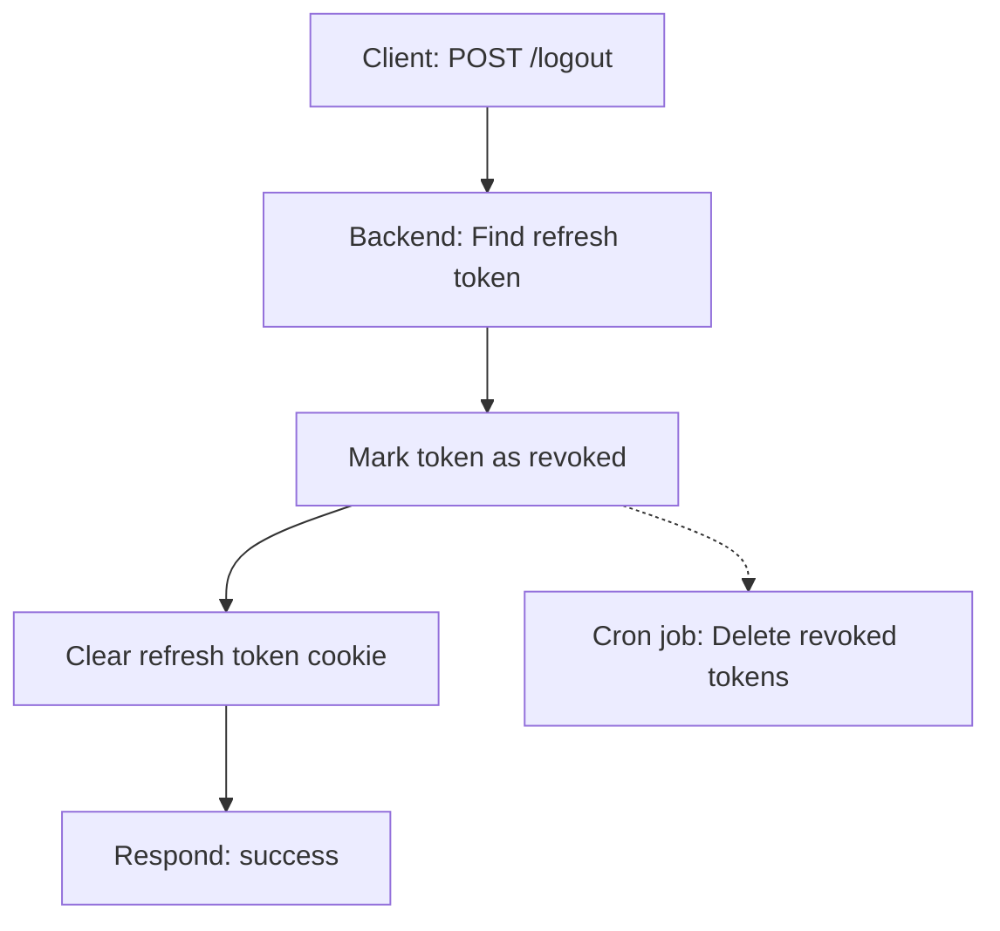
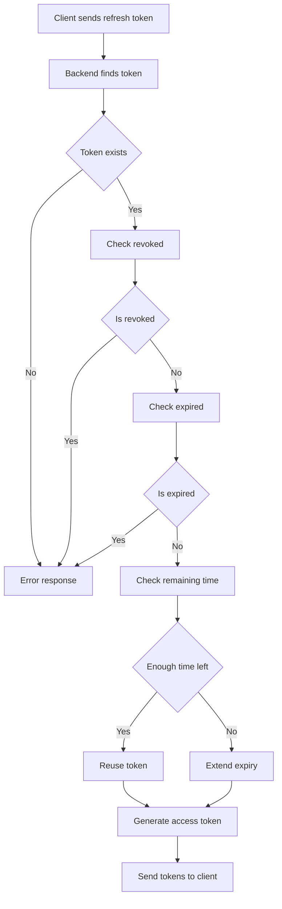

We will follow this flow throughout the authentication API building.



## Step 1: Start with Entity/Database Table Creation

- As discussed earlier regarding the pattern for implementing backend APIs, let’s start by creating entities for authentication and user management.
- In the `entity` folder, add an `account` folder. Inside it, create two entities:



- Add the `User` entity and explain its purpose.
- Create enums for the `User` entity as needed, and place them in the `definitions` package inside the `user` type.
- Install the workspace package into the `backend` to use the library.
- Next, add the `RefreshToken` entity and explain its purpose for authentication and refresh token management.
- After creating the entities, add migration scripts.
- Run the migration scripts one by one. If you encounter an error for the `ts-node` package, install it along with its types.
- Then, run the migration scripts sequentially.
- If the `generate` script gives a "no migration found" error, it’s because the `synchronize: true` option is enabled in the TypeORM `dataSource`. This option automatically creates the database schema based on the entities defined in the code, eliminating the need for manual migration scripts.
- Note: The `synchronize` option is for development purposes only. Do not enable it in production mode.
- Always use migration scripts in production to track changes.
- Add a development check condition in the `dataSource` for safety.
- After completing the migration, you can delete any empty migration files if there’s nothing to migrate, as the schema was already synchronized.

Additionally:

- Create a `repository` folder inside the `src` directory.
- Inside the `repository` folder, create a file named `index.ts`.
- In the `index.ts` file, export all repository classes from their respective files.
- These repository files will handle all database interactions for their respective entities, keeping the code organized and maintainable.

Let’s start with the `User` entity, then move on to authentication and refresh tokens.

## Step 2: Common Service for Database Operations

- Create a `services` folder inside the `src` directory.
- Inside the `services` folder, create a file named `common/base.ts`.
- The base service is a generic service class that provides common database operations such as:
  - `getAll`
  - `getById`
  - `create`
  - `createWithDuplicateCheck`
  - `update`
  - `updateWithDuplicateCheck`
- Other service classes can extend this base class to inherit these common methods in the future if needed.
- Create a common function named `handleDatabaseError` to return a standardized error response when a database error occurs.
- Provide an explanation of the base class and its purpose.

## Step 3: Create User Service Using the Base Service

- Create an `account` folder inside the `services` directory.
- Inside the `account` folder, create a file named `user.ts`.
- In the `user.ts` file, create a `UserService` class that extends the `BaseService` class.
- Call the `super` method with the `userRepository` and provide the `User` entity as the generic type while extending the base class. This ensures access to all the common methods for the `User` entity.
- Create the `getUserProfile` service to provide user profile information. Later, in the routes, we can add middleware to protect this route and ensure only authenticated users can access their profile information. The service should handle cases where the user is not found or not authorized.
- Create the `updateUserProfile` service to allow users to update their profile information. This service should also handle cases where the user is not found or not authorized. Since authentication middleware will be added in the routes, the service should return appropriate error messages if the user is not authenticated or authorized to update the profile.
- Based on our UI, these two services will be required, and we will need APIs to implement them.
- Services will only be used in controllers.

Our first service is done! We can now use this service in any controller. If we need new methods, we can add them and reuse them wherever needed in the future.

## Step 4: Controller Creation and Service Usage

- Create a `controllers` folder inside the `src` directory.
- Inside the `controllers` folder, create a folder named `account`. Follow the same structure as the `services` and `entity` folders.
- Create a `user.ts` file in the `account` folder. In the `user.ts` file, create a `UserController` class to handle incoming requests related to user operations from the routes.
- Create two methods: one for `getUserProfile` and another for `updateUserProfile`.
- Add `try-catch` blocks for error handling.
- Retrieve the `userId` or `id` from `req.user`, which means extracting the authenticated user’s ID. This ID will not be passed from the client as part of the request query. Instead, it will be retrieved from the token and set in the `req` object by middleware. For now, add it from the query.
- Note: Retrieving the `userId` or `id` from the query is not a good practice. In this case, any user can call the API with any `userId` or `id` to retrieve or update another user’s information.
- Ensure the value is updated from `req.user`. If you try this now, it will give an error in VS Code. We will add this functionality when we implement the middleware.
- You might ask how we will create a user. Users will be created through GitHub authentication. Anyone can create an account using their GitHub account, and we will get their `userId` from the GitHub profile information.
- The user creation process will be covered during the GitHub authentication implementation.
- As you can see, we are performing some common tasks like sending responses and catching errors consistently. Why not make these tasks common?
- Create common methods for response handling and a decorator for catching errors in any controller function. This will make the code cleaner. The `catchErrors` decorator is widely used in Nest.js backend frameworks. Here, you can get a simple flavor of it. You can leverage this decorator approach anywhere in our application.

## Step 5: Implementing the `catchErrors` Decorator and Common Response Handler

- Create a `decorators` folder inside the `src` directory.
- Inside the `decorators` folder, create a file named `catchErrors.ts`.
- In the `catchErrors.ts` file, create a `catchErrors` decorator function that takes `target`, `propertyKey`, and `descriptor` as parameters.
- The decorator should wrap the original method in a `try-catch` block and handle any errors that occur during the execution of the method.
- Explain the decorator’s purpose and how it enhances error handling in the controller.
- If an error occurs, the decorator should log the error and return a standardized error response.
- Use a custom logger for better logging.
- Create a `utils` folder inside the `src` directory.
- Inside the `utils` folder, create a file named `response.ts`.
- In the `response.ts` file, create the following functions:
  - `sendSuccess`
  - `sendError`
  - `sendValidationError`
- These functions should send a standardized JSON response with the provided data and status code.
- Use the decorator and response utility functions in the controller.

## Step 6: Create Auth Routes and Add Methods to Routes

- Create `UserRoutes` in `backend/src/routes/account/user.ts`. This file will contain all the user-related routes for the account module, including the profile and update profile routes.
- Create `backend/src/routes/index.ts` as the main route entry point where all routes will be added gradually. The `Routes` class will have an `Endpoints` method containing all the methods.
- Handle the 404 route here and explain the common error handling and response sending code.
- Add the routes to `backend/src/index.ts`, the main server entry file, so that they can be accessed.
- Move the "Hello World" route into the main routes entry point.
- Now we have our first user profile and update profile routes ready to use. Test them using Postman or any other API testing tool.
- Add an entry in the database and try updating and retrieving user information using Postman.
- If you get an error in the request body, you will need to add the express.json middleware to parse incoming JSON requests.
- Additionally, add URL encoding for the request body if you need to support form submissions from HTML forms in the future.
- As we can see, we are currently using a hardcoded userId from the response in the body or query. Later, we will retrieve it from the token using middleware.

## Step 7: Add Validation in the API Routes with a Validator Middleware

- Create your first middleware: `backend/src/middleware/validator.ts`. This will be used in all routes where validation with a schema is required.
- This validator will require Zod's type, such as `AnyZodObject`.
- Create that type in the definitions package so it can be used in both BE and FE.
- Add the newly created validator to the user route with the exact validation schema.
- Test it and demonstrate it.
- Make the imageUrl field optional, as you might not always provide it during profile updates.

With these steps, our user profile API is mostly done. Next, we need to work on user registration with GitHub OAuth and other APIs related to user authentication.

## Step 8: Implementing GitHub OAuth Services for User Registration



## Step 9: Creating the First Auth Service

- Create a new service file: `backend/src/services/account/auth.ts`.
- Create `AuthService` and the first method called `getGithubAuthUrl()`.
- Add `.env` values for `GITHUB_CLIENT_ID=your_client_id` and `GITHUB_CALLBACK_URL=http://localhost:5173/github-callback`.
- Add the github client ID, secret and Oauth redirection url info from this page in github `https://github.com/settings/developers` then use the code and secret. Add the frontend callback url and homepage url which will be the frontend app URL.
- Create the controller: `backend/src/controllers/account/auth.ts` and call the service.
- Create the routes: `backend/src/routes/account/auth.ts`.
- Add the route code and the first route.
- Add the router into the index route file.
- Test the API.
- Copy the URL from the API response, then open the front end to check the GitHub login flow.

## Step 10: Implementing the GitHub OAuth Flow

- Add another service for `handleGithubCallback()`.
- Install `axios` for API requests to GitHub for access token verification.
- Install `@octokit/rest` to fetch GitHub profile information using the access token. Explain what it is and how to use it. Look into the flow chart to understand what's happening in each step.



- Explain the above flow chart.
- Install the `jsonwebtoken` package for JWT generation and verification.
- Install the type package: `pnpm install --save-dev @types/jsonwebtoken` for TypeScript support.
- Explain the `generateJwtToken` function.
- Add the following `.env` values for secrets:

```shell title=".env"
GITHUB_CLIENT_SECRET=your_client_secret

# Auth secret and expiration
JWT_SECRET=A_VERY_LONG_RANDOM_STRING_FOR_JWT
ACCESS_TOKEN_EXPIRES_IN=15m # 15 minutes
REFRESH_TOKEN_EXPIRES_IN=604800 # 7 days
MAX_DEVICES_PER_USER=3 # We will allow a maximum of 3 devices per user
```

- Let's understand the `generateRefreshToken()` method.



- Great! Let's create our controller `handleGithubCallback()` and add the `COOKIE_CONFIG` constant.
- Explain the controller logic.
- Let's create the routes in `backend/src/routes/account/auth.ts`.

  ```
  this.router.get("/github/callback", handleGithubCallback);
  ```

- Now test both APIs: use the URL API to generate the URL, hit the URL to generate the code, then use the code to call the GitHub callback URL. It will return the access token in the response body and the refresh token in the response headers as `refreshToken`.

- Now we can use both tokens to verify our authenticated routes when we add middleware. The next step is to add middleware for our routes so that nobody can access protected resources without a valid token.

## Step 11: Adding the Logout API

- Added the logout service in our `auth.ts` service.
- We will mark the token as revoked when logging out.
- Optionally, we can delete the token from the database. However, for better history tracking, it is recommended not to delete it immediately. Instead, we can delete it after a week using a cron job.
- Created the logout controller in our `auth.ts` controller.
- Added the logout route in our `auth.ts` routes.
- Visualization of the logout flow:



1. The client sends a logout request (usually a POST) with the refresh token (often in a cookie).
2. The backend locates the refresh token in the database.
3. Instead of deleting the token immediately, it marks the token as revoked (`isRevoked = true`).
4. Optionally, a scheduled job (cron) can later delete revoked tokens for cleanup.
5. The backend clears the refresh token cookie from the client.
6. The client is now logged out and cannot use the old refresh token.

## Step 12: Implementing the Access Token Refresh API

- Added the `refreshAccessToken` service in our `auth.ts` service.
- Explained the service flow.
- Created the `refreshAccessToken` controller in our `auth.ts` controller.
- Added the `refreshAccessToken` route in our `auth.ts` routes.
- Visualization of the access token refresh flow:



1. The client sends a request to refresh the access token, providing the refresh token (usually in a cookie or header).
2. The backend verifies the refresh token:
   - Checks if it exists, is not revoked, and is not expired.
3. If valid, the backend generates a new access token (and optionally a new refresh token).
4. The backend updates the refresh token’s expiry or issues a new one, depending on the logic.
5. The new access token (and possibly refresh token) is sent back to the client.
6. The client can now use the new access token to access protected resources.

## Step 13: Now it's time to test all four APIs together to ensure they are working as expected.

- First, hit the `/github/url` API from the browser to get the OAuth URL.
- Run the frontend project as the GitHub callback requires the frontend's callback URL.
- Use the generated URL to authenticate the user.
- After authentication, you will get a code in the URL. This code is required to generate the access token.
- Use the code and make a GET request to `/github/callback?code=your_code`. This will generate an access token and set the refresh token in the cookie. Ensure you call this API from Postman so that the refresh token is automatically set in the cookie. This will allow you to use the token to regenerate the access token and extend the refresh token's expiration.
- Test the `/refresh-token` API to generate a new access token. This is a POST request and does not require any additional parameters. It will use the refresh token from the cookie to provide a new access token.
- If the above step is successful, test the logout API. Hit the `/logout` API to revoke the refresh token in the database and clear the cookie.

This way, you can test all four authentication APIs.
