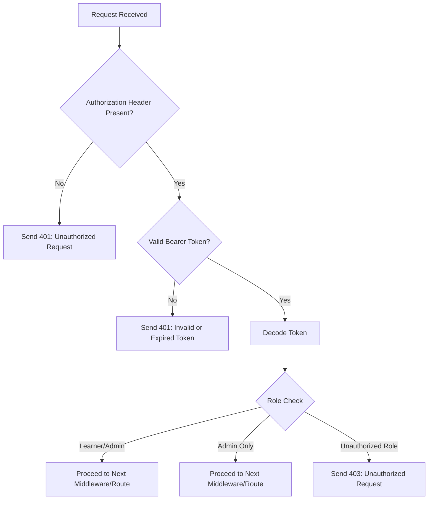

It's time to create the middleware to protect our routes.

## Step 1: Global Type Declaration for Express

- Create the middleware file `backend/src/middleware/auth.ts`.
- Add the global Express type declaration.

The global type declaration extends the `Express` namespace to include a custom `user` property on the `Request` object. This allows middleware to attach user-specific data (e.g., `userId` and `role`) to the request, making it accessible in subsequent handlers.

#### Structure of the `user` Property

- **`userId`**: A unique identifier for the authenticated user.
- **`role`**: The role of the user (e.g., `LEARNER`, `ADMIN`), defined by the `UserRole` enum.

#### Purpose

This ensures type safety and avoids TypeScript errors when accessing `req.user` in the application. By defining this globally, developers can confidently use `req.user` throughout the codebase without additional type assertions.

## Step 2: Understand Middleware with a Flowchart

Below is a flowchart explaining the flow of the authentication middleware:

### Explanation of Middleware Logic

1. **`authenticateJwt` Middleware**:

   - Checks if the `Authorization` header is present in the request.
   - Validates the format of the token (must be a Bearer token).
   - Verifies the token using the `authService.verifyToken` method.
   - Decodes the token and attaches the `user` object (containing `userId` and `role`) to the `req` object.
   - If any of these steps fail, an appropriate error response is sent (401 Unauthorized).

2. **`authenticateLearner` Middleware**:

   - Calls `authenticateJwt` to ensure the user is authenticated.
   - Checks if the user's role is either `LEARNER` or `ADMIN`.
   - If the role is valid, the request proceeds to the next middleware or route handler.
   - If the role is invalid, a 403 Forbidden response is sent.

3. **`authenticateAdmin` Middleware**:
   - Calls `authenticateJwt` to ensure the user is authenticated.
   - Checks if the user's role is `ADMIN`.
   - If the role is valid, the request proceeds to the next middleware or route handler.
   - If the role is invalid, a 403 Forbidden response is sent.

This structure ensures that routes are protected based on the user's authentication status and role, providing a robust mechanism for securing the application.

## Step 3: Wrap Middleware into Profile Routes

- Update the `getUserProfile` method to use `req.user?.id` for the `id` value.
- Update the `updateUserProfile` method to use `req.user?.id` for the `id` value.
- In the `routes/index.ts` file, add the middleware to the profile routes.
- Remove the older query-based ID validation `validator({ query: SIdParams })`. It is no longer needed as we are getting the `userId` from `req.user`, decoded from the token by the middleware.
- This will restrict access to the profile update and get APIs without an access token.

### Testing the Middleware

1. Log in by generating the GitHub URL from the browser.
2. Get the access token from the callback URL.
3. Use the access token to call the protected profile routes.

---

## 🎉 Success! 🎉

Congratulations! You have successfully implemented and tested the authentication middleware. Now, you can use these APIs with Postman or integrate them into your frontend application. From the next section, we will bind our APIs to the frontend to make the full feature work seamlessly. 🚀
