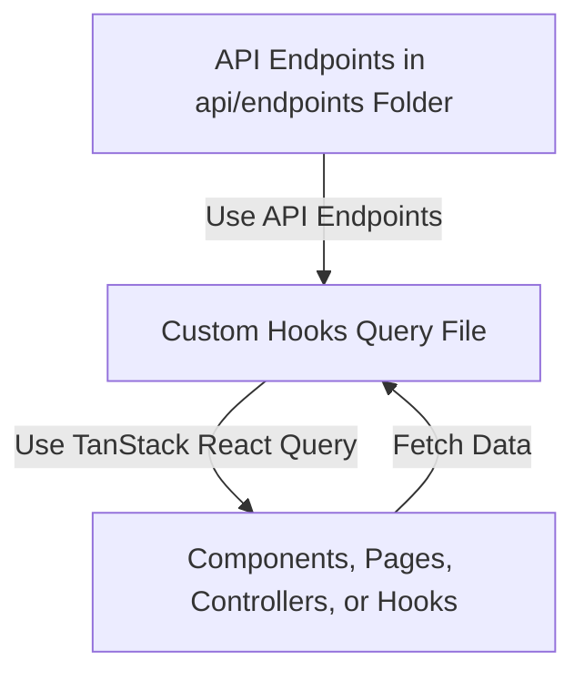
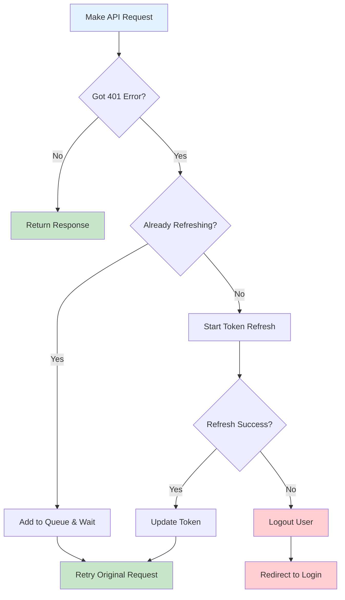
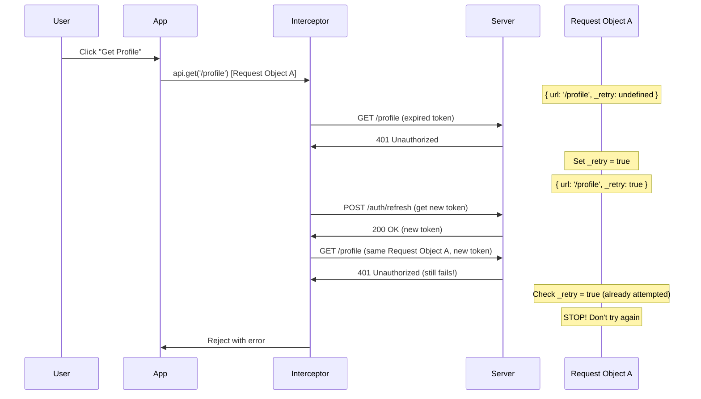

Before starting to bind our API in the frontend, note that running the frontend and backend separately, along with building packages manually, is not an efficient process. To streamline this, we will add build, clean, and start scripts to help us run the frontend, backend, and packages together. This way, any changes in any folder will reflect immediately.

## Step 1: Add Scripts

- In the main `package.json` file in the root folder, add the following scripts:

```json
    "dev:backend": "pnpm --filter=backend dev",
    "dev:frontend": "pnpm --filter=frontend dev",
    "dev:packages": "pnpm --filter=@packages/definitions dev",
    "build": "pnpm --recursive build",
    "build:definitions": "pnpm --filter=@packages/definitions build",

    "dev:all": "pnpm --filter=@packages/definitions dev & pnpm --filter=backend dev & pnpm --filter=frontend dev",

    "clean": "find . -type d -name 'node_modules' -o -name '.turbo' -o -name 'dist' -o -name 'build' -o -name '.next' -o -name 'out' | xargs rm -rf && find . -name 'pnpm-lock.yaml' -not -path './pnpm-lock.yaml' -o -name '*.log' -o -name '.DS_Store' | xargs rm -f",
```

- Explanation of each script:

  - **`dev:backend`**: Starts the backend development server.
  - **`dev:frontend`**: Starts the frontend development server.
  - **`dev:packages`**: Starts the development server for the `@packages/definitions` package.
  - **`build`**: Builds all packages recursively.
  - **`build:definitions`**: Builds only the `@packages/definitions` package.
  - **`dev:all`**: Runs the backend, frontend, and `@packages/definitions` development servers simultaneously.
  - **`clean`**: Cleans up all `node_modules`, build artifacts, and unnecessary files across the project.

- Try running the scripts to see the results:
  - First, build the definitions package or build everything using `pnpm run build`.
  - Then, run `pnpm run dev:all`.
  - You should see all services running correctly in the terminal.

Now we are ready to bind the API in the frontend.

## Step 2: API Wrapper with Axios for API Management and Query Client with TanStack Query

- We will use Axios and TanStack React Query for data fetching and caching.
- Install them using `pnpm install axios @tanstack/react-query`.
- Create an API folder and a common API file `frontend/src/api/index.ts`.
- Create a simple Axios instance with default settings and explain its purpose.
- Add `VITE_API_URL=http://localhost:8000/api` value in the `.env` file of the frontend project.
- Create a query client from TanStack React Query.
- Initialize the query client with the React Query provider in the `main.tsx` file at the root of the frontend project.
- Test a simple API call to ensure everything is working correctly.

```typescript title=frontend/src/routes/(website)/_layout/index.tsx
import { useQuery } from "@tanstack/react-query";
import { createFileRoute } from "@tanstack/react-router";

export const Route = createFileRoute("/(website)/_layout/")({
  component: RouteComponent,
});

function useFetchTodo(todoId: number) {
  return useQuery({
    // The query key is dynamic and includes the todoId
    queryKey: ["todo", todoId],

    // The query function is defined directly inside
    queryFn: async () => {
      const response = await fetch(
        `https://jsonplaceholder.typicode.com/todos/${todoId}`
      );

      if (!response.ok) {
        throw new Error("Network response was not ok");
      }

      return response.json();
    },

    // This query will only run if todoId is a truthy value (e.g., not null or undefined)
    enabled: !!todoId,
  });
}

function RouteComponent() {
  const { data, isLoading, isError, error } = useFetchTodo(5);
  if (isLoading) return <div>Loading...</div>;

  return <div>Hello "(website)/"! {data.title}</div>;
}
```

That's it! Our starter setup is ready. Later, we will add interceptors for handling access token management and refresh token management, which will be an important lesson.

## Step 3: Create the First API, API Query, and Use It

Before that, we will follow this pattern for the API fetching system.



- Create a new file `frontend/src/api/endpoints/auth.ts` and add the endpoint.
- Create the query for that endpoint in `frontend/src/hooks/query/account/auth.ts`.
- Since it will be triggered manually, we will use a mutation hook to give us full control over when the API is triggered.
- We can create a separate controller to keep things organized as a logic layer, as we did earlier. However, since this is a small piece of logic, we can keep it in the component. When it grows to more than two methods, we should extract it to a separate file.
- Test that it's working.

## Step 4: GitHub Callback API, Query, Handler, and Redirection

- Create the endpoint in `frontend/src/api/endpoints/auth.ts`.
- Create the query in `frontend/src/hooks/query/account/auth.ts`.
- Create a controller in `frontend/src/hooks/controller/account/useGithubCallbackController.ts`.
- Explain each step one by one.
- Test the sign-in without storing anything.
- Change any user's role in the database to admin, clear the cookie, and try to log in again.
- It should log in to the admin panel.

## Step 5: AuthStore to Persist Auth Data

- Now that it's working, we need to store the access token and the refresh token already set in our cookie. For this, we need a state management solution that can also persist information in local storage or session storage.
- Install Zustand as our state management tool: `pnpm install zustand`.
- Create some types for the auth store.
- Create the store in `frontend/src/store/authStore.ts`.
- Explain the code.
- Add the login action in the `useGithubCallbackController` so that before redirecting, we can store the information in the store.
- Test it.

## Step 6: Logout Functionality and User Information Display on Navbar and Sidebar

- Now let's first create the logout API and the query in `frontend/src/api/endpoints/auth.ts` and `frontend/src/hooks/query/account/auth.ts`.
- Let's create a hook controller for user info and auth info getter called `useAuthController()` so that we can use it anywhere we need. Explain why that's needed.
- Explain the `handleLogout()` method.
- Why user info? Explain that too.
- Let's use our controller in the navbar to make our logout dynamic.
  - `frontend/src/routes/(website)/_layout.tsx` updated.
  - `frontend/src/components/website/navbar.tsx` updated with `auth` props added, and all the buttons conditionally render based on user roles.
- Admin sidebar info added from the `useAuthController` hook: `frontend/src/routes/admin/_layout.tsx`.
- Learner sidebar info added from the `useAuthController` hook: `frontend/src/routes/learner/_layout.tsx`.
- That's how we can use the `useAuthController` hook to manage authentication state across different components.
- Test whether the Logout API is working or not from the network after the button click.

## Step 7: Protected Route Issue and Solution

- You can see now we can visit both the admin and learner routes without any issues, like `/learner/profile` and `/admin/profile`. However, users should only be able to visit routes based on their roles. For example, a learner should not access admin routes and vice versa.
- Let's fix this issue by creating our protected routes component.
- Create a protected route in `frontend/src/components/auth/protectedRoute.tsx`.
- Explain the route.
- Add the protected route as a wrapper for `frontend/src/routes/learner/_layout.tsx` and `frontend/src/routes/admin/_layout.tsx` with the requiredRole value from an enum to ensure proper protection.
- Test the `/profile` route to verify that admins cannot access learner routes and learners cannot access admin routes.
- Now let's add a not-found page for better user experience.
- Create a not-found component `frontend/src/components/common/notFound.tsx`.
- Add the component into `frontend/src/main.tsx` in the router instance `defaultNotFoundComponent()` method.
- Test the not-found page by visiting a non-existing route.
- Now you can see the theme is not always dark. It should retrieve the theme from storage.
- Add the `useTheme()` hook in the not-found component so that it retrieves the latest theme. That's it.
- Now the protected route should work.

## Step 8: Profile Info on Reload, Profile Page Data Display, and AppInitializer

- Now let's fetch our profile information once if we are logged in. This is necessary because our app depends on the authentication state and user information. So we have to call that API every time we reload the page.
- Create our profile API endpoint and query:
  - Profile endpoint: `frontend/src/api/endpoints/user.ts`
  - Profile query: `frontend/src/hooks/query/account/user.ts`
- Create a wrapper component to wrap our whole app: `frontend/src/components/common/appInitializer.tsx`. This component will handle global tasks, such as calling the profile API if we have an access token in local storage.
- If no access token is present, it will not call the profile API. This implementation prevents duplicate API calls, making the app more robust and controllable as it grows larger.
- Add the profile query hook to the wrapper component and call the profile API if the access token is present.
- Test the implementation. If you encounter a 401 Unauthorized error, it is expected because we are not providing the token in our request headers from Axios. Let's fix this by using Axios interceptors.
- In our `frontend/src/api/index.ts` main API file, add an interceptor to include the access token in the headers from our authStore. Since we are using Zustand, we can access it from anywhere. So cool!
- Test whether the API is working or not.
- If the token has expired, we will get an invalid token error. If not, we should be able to access the profile information. Re-login to get a new access token. We will add another mechanism to handle token expiration after 15 minutes. It will use the refresh token to fetch a new access token and continue the failed API request. We will address this later. Don't worry.
- After logging in again, you can see the profile API is called. If you refresh the page from anywhere, it will call the API to fetch the latest info. In the future, if we need similar functionality, we can use the same pattern.
- You might ask if it will hit the server every time. No, we have added a staleTime so that after this time, it will only fetch the API from the server instead of loading it from the cache. That's the beauty of TanStack Query.

## Step 9: Let's Fix the Access Token Expired Issue by Refreshing Access Token Again

- After 15 minutes, the access token will expire. If we try to call any API after that, it will give us a 401 Unauthorized error. So how can we handle this issue?
- Before explaining this, set `ACCESS_TOKEN_EXPIRES_IN=2m` in `backend/.env` so that the issue can be addressed.
- Add the code in `frontend/src/api/index.ts` to handle 401 errors globally and refresh the token if needed.
- This code ensures that if your app's authentication token (used to prove you're logged in) expires, it automatically gets a new one without bothering the user. Here's how it works:

Here is the flowchart:



- First, explain the flowchart with an overview.
- Then start implementing the try-catch logic, like this:

```typescript
try {
  // Lock to prevent multiple refresh attempts.
  isRefreshingToken = true;

  // Perform the token refresh.
  const newAccessToken = await handleTokenRefresh();

  // Update the original request's header and retry it.
  originalRequest.headers["Authorization"] = `Bearer ${newAccessToken}`;
  return api(originalRequest);
} finally {
  // Unlock after the process is complete.
  isRefreshingToken = false;
}
```

- Explain the logic for handling multiple refresh attempts by adding requests to a queue and waiting for the new token to be available before retrying.
- Explain this: `if (!originalRequest || !doesErrorNeedTokenRefresh(error))`.
- Then explain: `(originalRequest as any)._retry = true;`.
- The above condition ensures the same request object is reused, not a new one each time. Adding a flag to the config helps prevent multiple retries for the same request.

Simple fundamental diagram:



## Step 10: Profile Form Info and Profile Update Functionality

- First, retrieve user information using the `useAuthController()` hook in `frontend/src/hooks/controller/account/useProfileFormController.ts`.
- Use the `useEffect` hook to populate the form fields with the user's profile data (`name` and `imageUrl`) when the `user` object changes.
- Pass the user profile data to the form so that it pre-fills the fields.
- If you encounter type errors for fields like `lastLogin`, `createdAt`, or `updatedAt`, ensure these fields are included in the `User` type.
  - Add these fields in `packages/definitions/src/types/user.ts`.
  - Update the `createSafeUser` function in `frontend/src/stores/authStore.ts` to include these fields.
- Once the form is pre-filled with user data, make the `name` and `imageUrl` fields editable.
- Implement the profile update functionality:
  - Add the API endpoint for updating the profile in `frontend/src/api/endpoints/user.ts`.
  - Create a query for the update operation.
  - Update the `useProfileFormController` to include the mutation logic for submitting the updated profile data.

## 🎉 Success! 🎉

Great! The profile form is now fully functional, allowing users to view and update their profile information. With the authentication and routing setup complete, you can now focus on developing additional features.
