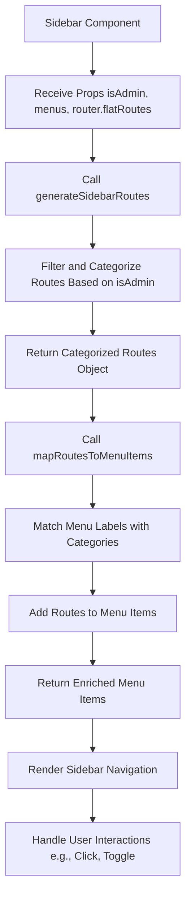
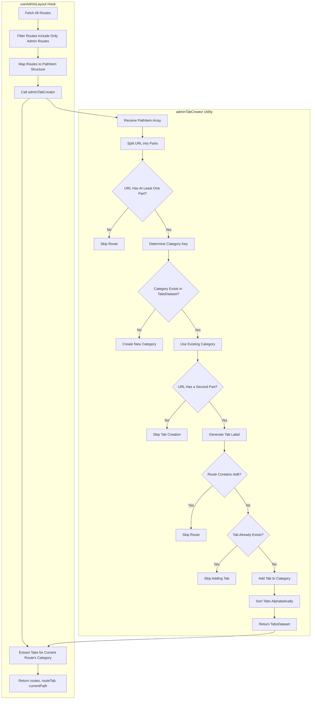

## Step 1: Fix the sidebar with dynamic route rendering

- We will create a route `frontend/src/routes/admin/_layout/course/all-courses.tsx`. It will be the parent route for all the course routes.
- However, you can see it is not working when we click on it. It should open the routes.
- As you can see, the menus array should include the URL as well.
- Here, we need to build the URL dynamically.

- Explain the utilities `generateSidebarRoutes` and `mapRoutesToMenuItems` and how we are using them to build the sidebar routes for admin and learner.
- Use the `generateSidebarRoutes` to filter the routes based on `isAdmin` and categorize them, then use it on the sidebar with the menus passed from `_layout`.
- Ensure all course routes work correctly.

### Benefits of this approach:

- **Automation**: Routes are dynamically generated and enriched, reducing manual effort.
- **Consistency**: Ensures the sidebar is always in sync with the application's route structure.
- **Scalability**: Easily handles large applications with many routes and roles.
- **Maintainability**: Centralized logic makes the code easier to maintain and update.
- **Dynamic Adaptation**: Sidebar adapts to user roles and permissions.
- **Error Reduction**: Reduces the risk of mismatched or missing routes.
- **Time-Saving**: Saves time for developers by automating repetitive tasks.

## Step 2: Create a layout for all admin panel routes

- We will create a layout component for all the admin routes. It will have a header and breadcrumbs in `frontend/src/components/admin/adminLayout.tsx`.

### Dynamic Breadcrumb Component

- We will create a breadcrumb component in `frontend/src/components/common/layout/breadCrumbs.tsx`.
- For the breadcrumb path, we will create a hook `frontend/src/hooks/ui/adminLayout.tsx` to get the path from the URL.
- Use the AdminLayout component in `frontend/src/routes/admin/_layout/course/all-courses.tsx`.
- Provide an example with a new route creation and the use of the admin layout.

### Dynamic Tabs Component

- We will create a tabs component in `frontend/src/components/common/layout/tabs.tsx`.
- Update the `frontend/src/hooks/ui/adminLayout.tsx` hook to get the tabs from the URL and router flat routes.
- Create `frontend/src/utilities/ui/adminTabCreator.ts` utility to get the tabs from the URL and router flat routes.

- Use the tabs component in the `frontend/src/components/admin/adminLayout.tsx` file and update those tabs dynamically.
- Remove the title from `frontend/src/routes/admin/_layout/course/all-courses.tsx` for a dynamic title from the URL.
- Create a new route `frontend/src/routes/admin/_layout/course/new-course.tsx` to create a course and use the admin layout. Check if the tabs are working.
- Now, create the edit route `frontend/src/routes/admin/_layout/course/$courseId.edit-course.tsx` to edit a course and check if the tabs are working. It should not be visible in the tabs because we have already handled it in the utility.
