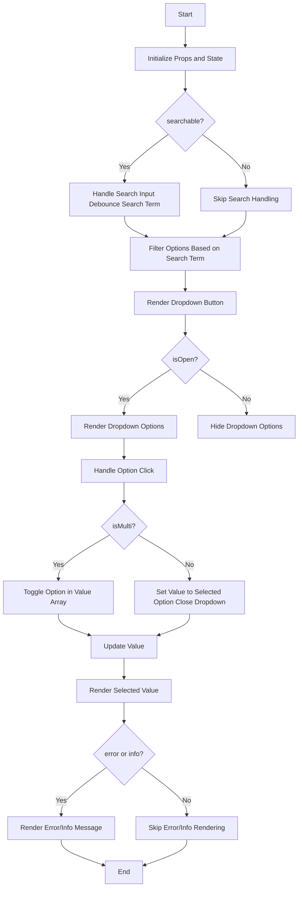
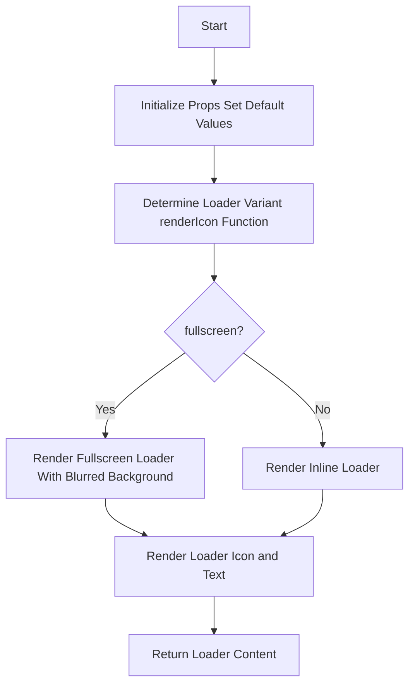
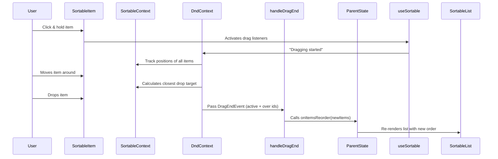
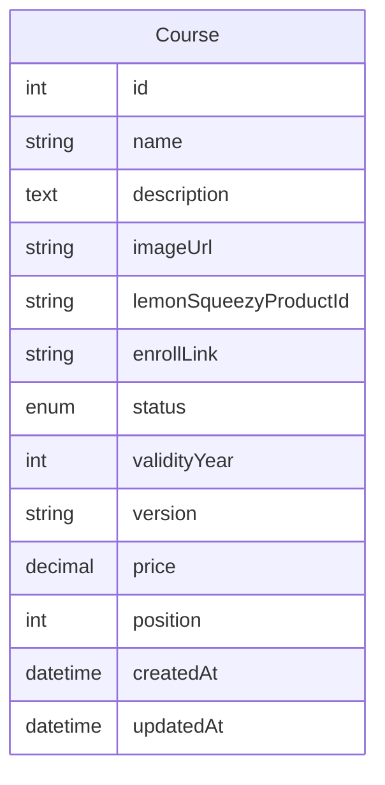
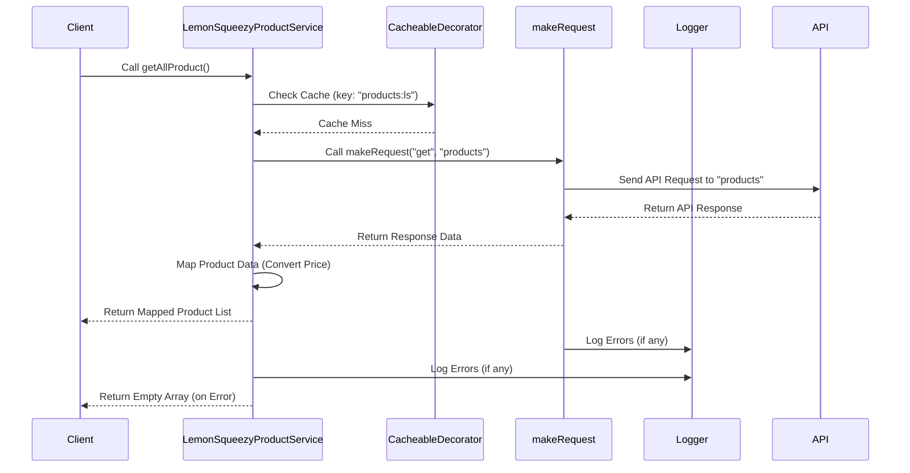

## Step 1: Course Form Page UI

- Before creating the course form, we will create some common components for the form.
- Create a form wrapper component in `frontend/src/components/admin/course/courseForm.tsx`.
- Add basic design to the form components.

### Create Select Component

- Create a select component in `frontend/src/components/common/form/select.tsx`.
- Create the select component and use it in the course form.

- Create all the selects needed for the course form.
- In the status select, first create the enum in our common definitions package in `packages/definitions/src/types/course.ts` named `ECourseStatus`.
- Then use it in the select component.
- The Lemon Squeezy product dropdown will retrieve the product from the Lemon Squeezy API. However, it will call our backend API to get the product list from Lemon Squeezy.
- When it is selected, other disabled info fields will be filled with the product info.

### Add Input Fields for the Course Form

- Add all the necessary input fields for the course form based on business logic.
- Price, description, and course image fields will be filled from the Lemon Squeezy product selection.
- The description can be edited, and it will be an example of using a text area with the same input component.

### Save and Update Course Common Action Component

- Create a save and update action component to be used in the form component footer to handle save or edit buttons. Create this in `frontend/src/components/admin/actionFooter.tsx`.
- Use the action footer component in the course form for the new course page.
- Add the course form in `frontend/src/routes/admin/_layout/course/$courseId.edit-course.tsx` by passing the courseId from the URL.
- Conditionally change the save button to an update button if we are in edit mode.
- Test both the create and edit course pages.

### A Loading Component for Reuse

- Create a loading component in `frontend/src/components/common/loading.tsx`.

- Use this loading component in the course form when fetching the course data for editing.
- Why this? We will use it when fetching dropdown data from the API to load the dropdown options before rendering the component.
- It will provide a better user experience.
- Now test both page UIs.

### Course Form Validations

- Let's create a validation schema for the course form in `packages/definitions/src/validations/course.ts` using Zod.
- Export it from `packages/definitions/src/validations/index.ts`.
- Create a type from here: `packages/definitions/src/types/course.ts` for the course form using `z.infer`.
- Create a controller hook for managing our form here: `frontend/src/hooks/controller/course/useCourseFormController.ts`. Pass the id also for handling edit mode.
- Use the controller `useCourseFormController()` in the `CourseForm` component.
- Wrap the form with `react-hook-form` `control` and `<Controller/>`.
- Test the validations on both create and edit pages to ensure they are working correctly.
- Let's build our frontend and check for any errors. This is important to track the bundle size and ensure there are no build errors from the beginning of the project.

## Step 2: Course List Page UI

### Module Header Component

- Let's create the Module Header component in `frontend/src/components/common/layout/moduleHeader.tsx`.
- Add the Module Header component in `frontend/src/routes/admin/_layout/course/all-courses.tsx`.
- Create a simple controller hook `useCourseListController()` in `frontend/src/hooks/controller/course/useCourseListController.ts` to manage the search for now. Later, we will add more features.

### Course List Draggable List Component

- As we are going to work with a list UI and will have a drag-and-drop feature, let's first install the necessary library: `pnpm run @dnd-kit/core @dnd-kit/sortable @dnd-kit/utilities`.
- All these packages are from `dnd-kit`, which is a modern drag-and-drop library for React.
- We need a badge component as well. Let's create a small badge component in `frontend/src/components/common/badge.tsx`. You can also use any badge from a UI library.
- Let's create a draggable list component, which will be a common reusable component for any list with drag-and-drop functionality, in `frontend/src/components/common/sortableList.tsx`.

#### Let's see what's going on in this component:

Think of it like:

- DndContext = game board.
- SortableContext = group of pieces on the board.
- SortableItem = each draggable piece.
- arrayMove = reshuffles the pieces when you drop them.
- onItemsReorder = tells your parent component “Hey, the list changed!"
- SortableList → Parent, sets up the drag-and-drop area.
- SortableItem → Child, makes each item draggable.
- DndContext → Brain, manages drag start and end.
- SortableContext → Organizer, knows all items in the list.
- useSortable → Glue, gives each item drag properties.

Another Example: Think of this like rearranging sticky notes on a board

- DndContext = the board.
- SortableContext = group of sticky notes.
- SortableItem = one sticky note.
- useSortable = tape/glue that makes the sticky note movable.
- handleDragEnd + arrayMove = when you finish moving, the notes get re-ordered.
- onItemsReorder = tells your app state, "this is the new sticky note order."

#### Use the Sortable List Component

- Use this sortable list component in the course list page.
- Before adding the SortableList, we need data. Let's create mock data and data types for that.
- Create the `ICourse` type in `packages/definitions/src/types/course.ts` for the course list item.
- Add the data into the controller `frontend/src/hooks/controller/course/useCourseListController.ts`.
- Add other necessary states for managing the courses data.
- Add the SortableList component to the course list page.
- Add the types.
- Pass methods that will help reorder the list.
- Pass the customized item we want to render for each list item. Create the courseItem `frontend/src/components/admin/course/courseItem.tsx` component for that.
- Create an item like this to use the sortable list component.
- Add the item to check the list.
- Create the method to reorder the list in the controller and pass it to the SortableList component.
- Check the drag-and-drop feature. It should work fine.
- Extra props are for passing any extra props to the item component.

#### Sortable List Method

- Add all the methods for sorting the list in the controller.
- Add the button we need to the module header to enable the reorder mode.
- Create a state `isReorderMode` in the controller to manage the reorder mode.
- When the reorder mode is enabled, show the save and cancel buttons in the module header.
- Manage that functionality.
- Test if the reorder mode is working.

#### Alert Modal in the List

- Create a common alert modal component in `frontend/src/components/common/modal/alertModal.tsx` to use it in the course list page for archiving a course.
- Use the alert modal in the course list page.
- Create a state `archivedModalOpen` in the controller to manage the alert modal. This will also hold the courseId we want to archive.
- Create methods to confirm and cancel the archive action.
- Add the extra props to the course item to handle the archive action as we declared before.
- Check if the archive action is working. You should see the alert modal when you click on the archive button.

## Step 3: Create Backend APIs for Course

- Let's create the backend APIs for the course module.
- We will follow the pattern like entity, repository, service, and controller and route.

### Entity

- Create the course entity in `backend/src/entity/course/course.ts`.
- Add the necessary fields based on the business logic.

### Repository

- Create the course repository in `backend/src/repository/index.ts`.
  `export const CourseRepository = AppDataSource.getRepository(Course);`
- Use the repository in the service.

### Services

#### listCourses()

- Before service let's create two types in our definitions package. `CourseListOptions` and `PaginatedCourseResult`, last one need to be omit and reassign the courses type again on the backend as per our need.
- Let's create our first service in `backend/src/services/course/course.ts`
- `listCourses()` this service will handle the course listing with pagination and search.
- Type need to be fixed for courses from entity type to our definitions type.
- Explain the ORM query builder and how we are using it to build our queries.
- Not needed the modules, chapters, and lessons count. Commented for now. we will add them later when we will create those modules, chapters, and lessons entities and their relations one by one.

#### getCourseById()

- `getCourseById()` this service will handle getting a single course by id.
- It will provide course which is published only.

#### createCourse()

- `createCourse()` this service will handle creating a course.
- It will check if the Lemon Squeezy product id is already used or not.
- If not, it will create a new course.
- And it will also set the position of the course to the last if no position is provided.
- It will return the created course.

#### updateCourse()

- `updateCourse()` this service will handle updating a course.
- It will check if the course exists or not.
- It will use the base update method for updating the course.

#### archiveCourse()

- `archiveCourse()` this service will handle archiving a course.
- It will check if the course exists or not.
- It will set the status to archived.
- Will follow same mechanism for archiving by using update method.

#### updateCoursePositions()

- `updateCoursePositions()` this service will handle updating the course positions.
- Let's create the type and validation first for this in our definitions package `CoursePositionUpdate`. It will be a common type and validation as it will be used in course, module, chapter, and lesson all to update the positions of the respective entities.
- As you can see we can refactor types and validations later to make it more generic. Let's do it.
- After all create the validation schema `SUpdatePositionArray` in `packages/definitions/src/validations/common.ts`.
- Create the type `TUpdatePositionArray` in `packages/definitions/src/types/common.ts`.
- It will take an array of course ids and their new positions.
- Let's create the service now `updateCoursePositions()`.
- It will update the positions of the courses in a transaction.
- A simple query to make that happen. So Cool!

#### findCourseWithNestedRelations()

- This one should not be included now. After completing the whole hierarchy of course, module, chapter, and lesson we will create this service to fetch the course with all the nested relations.
- So we will revisit this later.

### Controller

- Create `getPublicCourses()` and explain
- Create `getPublicCourse()` and explain
- Create `getCourses()` and explain
- Create `getCourse()` and explain
- Create `createCourse()` and explain
- Create `updateCourse()` and explain
- Create `archiveCourse()` and explain
- Create `updateCoursePositions()`
- Add/Update the necessary validations/type using the validation schemas we created before for `updateCoursePositions()` controller method.

### Routes

- Create a list pagination result schema validation for our list course API query validations name it `SPaginationQuery` in `packages/definitions/src/validations/common.ts`.
- Create the routes in `backend/src/routes/course.ts`.
- Add the necessary middlewares for authentication and authorization.
- Add the necessary validations and types for each route.
- Let's add `adminEndpoints` in the index file of the routes folder. in `backend/src/routes/index.ts`.
- Add the course routes to the main app in `backend/src/routes/index.ts`.
- Now we can test all the routes using Postman or any API testing tool.
- But we will start binding the frontend with the backend APIs so that we can test the APIs while working on the frontend and working fine. got it?

## Step 4: Lemon Squeezy Product API

### Service

- Add lemon squeezy secret key to the `.env` file.
- Let's start with the service in as this will not need any entity or repository.
- Create the service in `backend/src/services/lemonSqueezy/lemonSqueezy.ts`.
- Add lemon squeezy service needed schemas and types in our definitions package in `packages/definitions/src/validations/lemonSqueezy.ts`
- Here is the flow of the service:

### Decorator

- Create a cacheable decorator in `backend/src/decorators/cacheDecorator.ts` to cache the lemon squeezy products for `oneWeek`.
- This will help to cache the products and reduce the API calls to lemon squeezy as it has a rate limit. So we need to be careful about that.
- As we added cache here so it will only call once a week to get the products from lemon squeezy. So if we add a new product in lemon squeezy it will not be reflected here until the cache expires. We can create another API to clear the cache if needed. But for now, this is fine.
- You can adjust the cache time as per your need.

### Controller & Routes

- Create the controller in `backend/src/controllers/course/lemonSqueezyProduct.ts`.
- Very small controller and easy explanation.
- Create the route in `backend/src/routes/course/lemonSqueezyProduct.ts`.
- Add the route to the index route file `backend/src/routes/index.ts`.
- This API only accessible to admin. So let's add the necessary middlewares for authentication and authorization.
- Cool! Now this api will help to retrieve the products from lemon squeezy and use it in the course create page as dropdown to load the products and select which will pre-fill other fields like price, description, and image and then we can go for save the course.

## Step 5: Bind Frontend with Backend APIs

- As our UI is ready we can now start binding the frontend with the backend APIs.
- First we will start with the create API. then list api then update api and archive api and last we will bind the reorder api to complete the course module.

### Bind Create Course

- First we need to load the lemon squeezy products in the create course page in the dropdown data.

### Endpoints and types

- let's create an endpoint file for course and define all of our apis there.
- for get coursesApi we can pass query so let's create a utility to convert an object to query string in `frontend/src/utilities/helper/buildQueryString.ts`.
- Add all the necessary types for the endpoints using the definitions package.
- Use the proper type from the definitions package in the endpoint file.
- You can see it's also matching with our routes and controller staff.

### Query Hooks for all endpoints

- We are gonna create query hooks for all the endpoints we created.
- It will help to use those query hooks in our components. So creating all together will make us productive.
- Let's create all the type adjustments we need in the definitions package.
- Build and check any type error from any packages or source code.
- Create the query hooks in `frontend/src/hooks/query/course.ts`.
- Explain the `COURSE_KEYS` and how we are using it to manage the query keys for react-query.
- We have to name based on it's useCase. If we use query? we should name it with query. If we use mutation we should name it with mutation. It will help to identify the use case of the query hook.
- Explain one by one query hook and how we are using the types we created before.
- So that's the beauty if we have type created first it's really easy to write code further.
- Now from the components or controller we can just simply use the query hooks we created here to api interaction.

:::warning
find and fix some of the other query name to follow conventions
:::

### Bind Lemon Squeezy Products List Api for dropdown

- Add the query hook api `useLemonSqueezyProductsQuery` in the controller file
- So for that case we can use the `useLemonSqueezyProductsQuery` hook to get the products list and then find the selected product from the list.
- Update the onchange method of the dropdown to set the other fields when a product is selected so add a method `setOtherFieldValues()` which will find the selected product from the products list and set the other fields like price, description, and image url.

### Bind Create, Update Course API

- Add the query hook api `useCreateCourseMutation()` in the controller file
- Add the query hook api `useUpdateCourseMutation()` in the controller file
- Add pending state from create and update mutation to the form submit button to show loading state.
- Update onSubmit method of the form to call the create or update mutation based on the mode.
- Let's test the create course page. It should work fine.

### Bind the get course by id api for edit page data show

- Add the query hook api `useGetCourseQuery(id)` in the controller file with the id from the controller param.
- Add pending state from get course query to show the `courseDataLoading` state.
- In the `useEffect()` hook set the form default values when the data is fetched.
- Let's test the edit course page. It should work fine.
- Test both create and edit course pages to ensure they are working fine with the backend APIs.

### Bind course list api

- First fetch the course list from the backend api by using the query hook `useGetCoursesQuery()`. Also pass the status as we can filter the course by status.
- Let do the useEffect to set the courses data when the data is fetched. As we need to manage the courses data in the controller state to handle the reorder functionality. So a different state is needed.
- Now let's see the courses loaded or not. Also add loading state when the data is being fetched.
- Let's create a new component for that `NoDataFound`
- If no data found show that component otherwise if loading show loading component otherwise show the sortable list as it is using the data.
- let's add the filter functionality to filter the course by status.
- let's add the search functionality to search the course by name by useEffect
- Now test the course list page. It should work fine.
- Now let's work on the archive functionality.
- Add the query hook api `useArchiveCourseMutation()` in the controller file
- Add pending state from archive mutation to show loading state in the confirm button of the alert modal
- Update the confirm method and test all working fine or not..
- Now let's work on the reorder functionality.
- Add the query hook api `useUpdateCoursePositionsMutation()` in the controller file
- Add `saveChanges` method to call the update positions mutation with the new positions.
- Add pending state from update positions mutation to show loading state in the save button of the module header
- Update all the corresponding method related to the reorder functionality.
- Test the reorder functionality. It should work fine.
- Now test the complete course module to ensure all are working fine.
