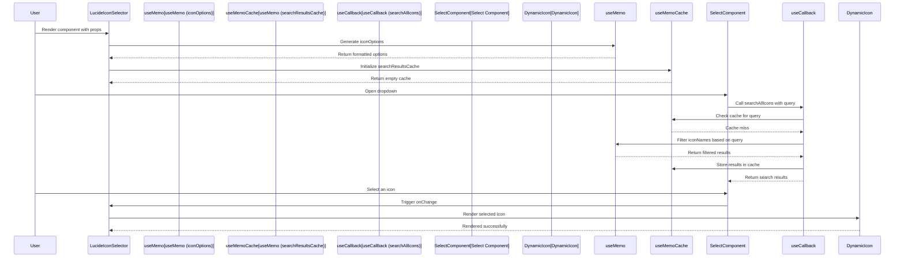
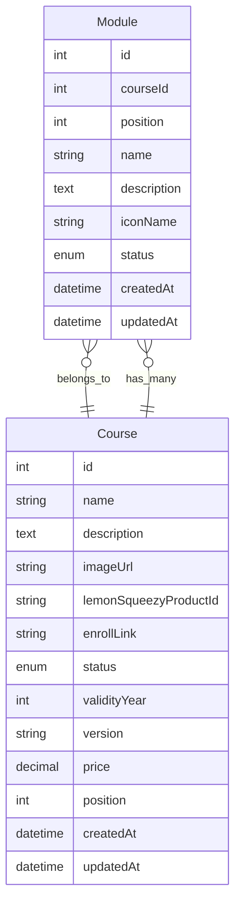

## Step 1: Module Form Page UI

- Create new pages for `all-modules`, `new-module`, and `edit-module` in `src/routes/admin/_layout/module`.
- Develop a `ModuleForm` component in `src/components/admin/course/ModuleForm.tsx`.
- Implement a controller hook for module form logic in `src/hooks/controller/course/useModuleFormController.ts`.

### Schemas and Types

- Create `module.ts` in `src/types` and `src/validations` for module-related types and validations.
- Define all the types and schemas required for the module form.

### Form UI with Zod and React Hook Form

- Start with `useForm()` using `zodResolver`.
- Load the course list API with `useGetCoursesQuery`.
- Implement a dummy `onSubmit` function to handle module creation.
- Complete the form UI, excluding the `LucideIconSelector` component.

### LucideIconSelector Component

- Create the `LucideIconSelector` component and provide an explanation.
- Finalize the `ModuleForm` UI.



### Module Form UI Test with Validation

- Test the `new-module` and `edit-module` pages to ensure the UI works correctly with validations.

## Step 2: Module List Page UI

- Create a page for `all-modules` in `src/routes/admin/_layout/module/all-modules`.
- Develop a controller hook for module list logic in `src/hooks/controller/course/useModuleListController.ts`.

### Header UI and Methods

- Create a `ModuleHeader` component.
- Add a dropdown menu.

### Reorder Buttons Component

- Refactor the reorder button into a separate component, `ReorderButtons`.
- Create `RenderButtons` in `frontend/src/components/common/reorderButtons.tsx`.
- Add all necessary state and methods for the header UI in `useModuleListController`:
  - Set the `selectedCourse` to the first course in the list when the course list is fetched.
  - Fetch the course list using `useGetCoursesQuery`.
  - Declare states such as `status`, `searchQuery`, `isReorderMode`, and `selectedCourse`.
  - Implement methods for reordering, saving, canceling, and toggling reorder mode.
- Update the `all-courses` page with the new `RenderButtons` component to reduce code duplication.

### Module List in Sortable List

- Add a `SortableList` component and its types.
- Create a `ModuleItem` component in `frontend/src/components/admin/course/moduleItem.tsx`.
- Provide an explanation of the component and its props.
- Integrate the sortable list into the `all-modules` page.

### Loading and No Data UI Refactor in SortableList

- Copy the loading and no data UI from the user list page to the `SortableList` component. Display the loading UI if data is loading, the no data UI if there is no data, and the list otherwise.
- Remove the loading and no data UI from the `all-modules` page.
- Update the `all-courses` page with the new `isLoading` prop in the `SortableList` component to reduce code duplication.

### Alert Modal for Archived Modules

- Add a modal and its methods in `useModuleListController`.
- Test the UI.
- Finalize the module UI page. Test the list data by adding dummy data locally to the module state.

## Step 3: Module Backend Implementation

### Entity

- Create a `Module` entity in `src/entities/module.ts`.
- Update the `Course` entity to establish a relationship:
  - A course has a `OneToMany` relationship with modules.
  - A module has a `ManyToOne` relationship with a course.



### Repository

- Add `ModuleRepository` in `backend/src/repository/index.ts`.

### Services

- Create `ModuleService` in `backend/src/services/course/module.ts`.
- Implement the following methods for the module service:
  - `listModules`
  - `createModule`
  - `updateModule`
  - `archiveModule`
  - `updateModulePositions`
- Fix the common type `IListOptions` in `packages/definitions`.
- Update the course service to use the `IListOptions` type for consistency with the module service.
- Provide explanations for all methods.

### Controller

- Create a controller in `backend/src/controllers/course/module.ts`.
- Implement all methods for the module controller.
- Provide explanations for all methods.

### Routes

- Create a route in `backend/src/routes/course/module.ts`.
- Add validation schemas to the routes.
- Provide explanations for all routes.
- Add the `ModuleRouter` to `backend/src/routes/index.ts` to enable the `/api/admin/module` endpoint.

## Step 4: Bind Frontend with Backend APIs

### Update Necessary Types

- Rename schemas and types, and add new types in `packages/definitions/src/types/module.ts`.

### Endpoints and Types

- Create endpoints for all module APIs in `frontend/src/api/endpoints/module.ts`.
- Provide explanations for all methods.

### Query Hooks for All Endpoints

- Create query hooks for all module APIs in `frontend/src/hooks/query/course/module.ts`.
- Ensure all query hook names are consistent with existing naming conventions.

### Bind Create and Update Course APIs

- Add module creation and update mutations in `useModuleFormController`.
- Update the `onSubmit` function to call the appropriate mutation based on the mode.
- After a successful create or update operation, navigate to the `all-modules` page and display a toast message.

### Bind Get by ID API for Edit Page

- Load module data by ID in the `edit-module` page using `useGetModuleQuery(id)`.
- Use `useEffect` to set the default form values when module data is loaded.
- Improve the naming of loading states in the `edit-module` page.
- Refine the loading state naming in the course form component.
- Verify that the create, edit, and get by ID APIs work correctly with the frontend and backend.
- Build the project and fix any errors or warnings, such as type errors.

### Bind Module List API

- Remove dummy data from the `all-modules` page.
- Load module list data in `useModuleListController` using `useGetModulesQuery` with `status` and `courseId`.
- Add mutations for `updatePositions` and `archiveModule` in `useModuleListController`.
- Use `useEffect` to set modules after data is fetched from the API.
- Implement search functionality for the module list using `useEffect`.
- Update `saveChanges` and `confirmArchivedOperation` to call the appropriate mutations.
- Improve the naming of loading states in the `all-modules` page.
- Update the course list service to include the module count:

```typescript
.loadRelationCountAndMap("course.moduleCount", "course.modules");
```

- Test all functionalities thoroughly, including create, edit, list, reorder, archive, search, and filter.
- Verify that the course list displays the module count.
