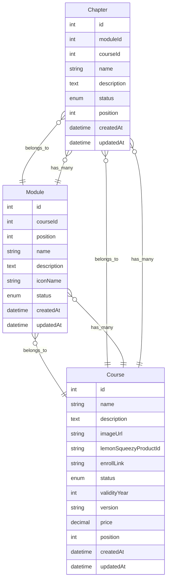

## Step 1: Chapter Backend Implementation

### Entity

- Create a `Chapter` entity in `src/entities/chapter.ts`.
- Update the `Course` entity to establish a relationship:
  - A course has a `OneToMany` relationship with chapters.
  - A chapter has a `ManyToOne` relationship with a course.
- Update the `Module` entity to establish a relationship:
  - A module has a `OneToMany` relationship with chapters.
  - A chapter has a `ManyToOne` relationship with a module.



### Repository

- Add `ChapterRepository` in `backend/src/repository/index.ts`.

### Schemas and Types

- Add and update all the necessary types and schemas in definitions package.
- Create `chapter.ts` in `src/types` and `src/validations` for chapter-related types and validations.
- Define all the types and schemas required for the chapter form.

### Services

- Create `ChapterService` in `backend/src/services/course/chapter.ts`.
- Implement the following methods for the chapter service:
  - `listChapters`
  - `createChapter`
  - `updateChapter`
  - `archiveChapter`
  - `updateChapterPositions`
- Update the course list service to include the chapter count, Now we will get both module count and chapter count in the course list API.

```typescript
.loadRelationCountAndMap("course.chapterCount", "course.chapters")
```

### Controller

- Create a controller in `backend/src/controllers/course/chapter.ts`.
- Implement all methods for the chapter controller.
- Provide explanations for all methods.

### Routes

- Create a route in `backend/src/routes/course/chapter.ts`.
- Add validation schemas to the routes.
- Provide explanations for all routes.
- Add the `ChapterRouter` to `backend/src/routes/index.ts` to enable the `/api/admin/chapter` endpoint.

## Step 2: Frontend API Setup

### Endpoints and Types

- Create endpoints for all chapter APIs in `frontend/src/api/endpoints/chapter.ts`.
- Provide explanations for all methods.

### Query Hooks for All Endpoints

- Create query hooks for all chapter APIs in `frontend/src/hooks/query/course/chapter.ts`.
- Ensure all query hook names are consistent with existing naming conventions.

## Step 3: Chapter Create and Edit

### Ui Pages and Components

- Create new pages for `all-chapters`, `new-chapter`, and `edit-chapter` in `src/routes/admin/_layout/chapter`.
- Develop a `ChapterForm` component in `src/components/admin/course/ChapterForm.tsx`.
- Implement a controller hook for chapter form logic in `src/hooks/controller/course/useChapterFormController.ts`.

### Create/Edit Form UI with Zod and React Hook Form

- Start with `useForm()` using `zodResolver`.
- Load the course list API with `useGetCoursesQuery`.
- Implement `onSubmit` with other functions to handle chapter creation.
- Test the `new-chapter` and `edit-chapter` pages to ensure the UI works correctly with validations.

### Bind Create and Update APIs

- Add chapter creation and update mutations in `useChapterFormController`.
- Update the `onSubmit` function to call the appropriate mutation based on the mode.
- Test both working fine.

### Bind Get by ID API for Edit Page

- Load chapter data by ID in the `edit-chapter` page using `useGetChapterQuery(id)`.
- Use `useEffect` to set the default form values when chapter data is loaded.
- Improve the naming of loading states in the `edit-chapter` page.
- Refine the loading state naming in the course form component.
- Verify that the create, edit, and get by ID APIs work correctly with the frontend and backend.
- Build the project and fix any errors or warnings, such as type errors.

## Step 4: Chapter List

### Ui Pages and Components

- Create a page for `all-chapters` in `src/routes/admin/_layout/chapter/all-chapters`.
- Develop a controller hook for chapter list logic in `src/hooks/controller/course/useChapterListController.ts`.
- Create a `ChapterHeader` component.
- Add a dropdown menu.
- Add a `SortableList` component and its types.
- Create a `ChapterItem` component in `frontend/src/components/admin/course/chapterItem.tsx`.
- Provide an explanation of the component and its props.
- Integrate the sortable list into the `all-chapters` page.
- Add a modal and its methods in `useChapterListController`.
- Test the UI.
- Finalize the chapter UI page. Test the list data by adding dummy data locally to the chapter state.

### Bind Chapter List API

- Remove dummy data from the `all-chapters` page.
- Load chapter list data in `useChapterListController` using `useGetChaptersQuery` with `status` and `courseId`.
- Add mutations for `updatePositions` and `archiveChapter` in `useChapterListController`.
- Use `useEffect` to set chapters after data is fetched from the API.
- Implement search functionality for the chapter list using `useEffect`.
- Update `saveChanges` and `confirmArchivedOperation` to call the appropriate mutations.
- Improve the naming of loading states in the `all-chapters` page.
- Test all functionalities thoroughly, including create, edit, list, reorder, archive, search, and filter.
- Verify that the course list displays the chapter count.
