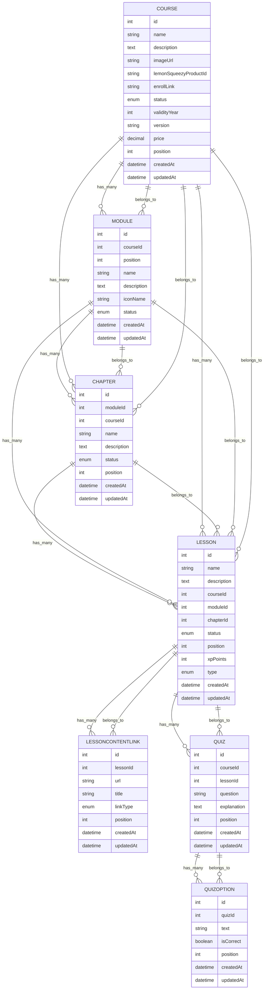
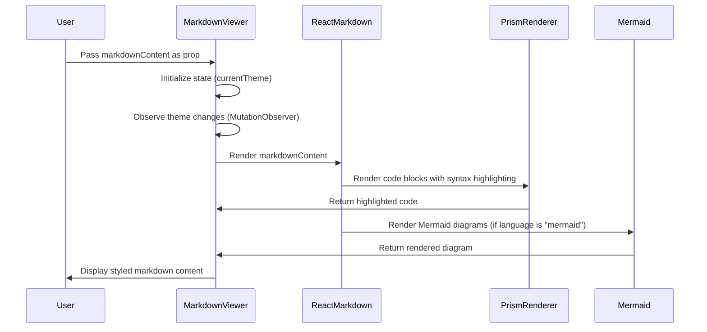
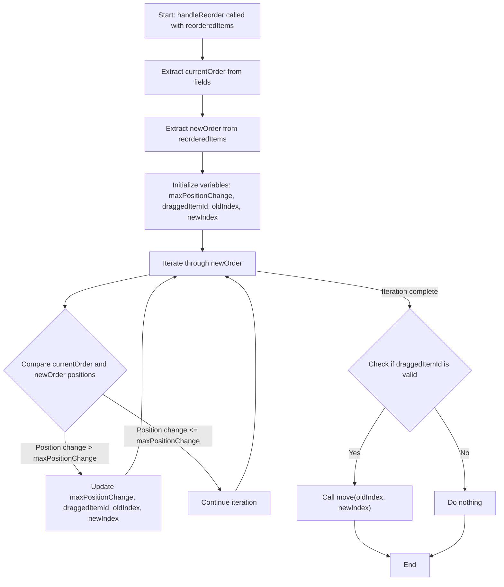
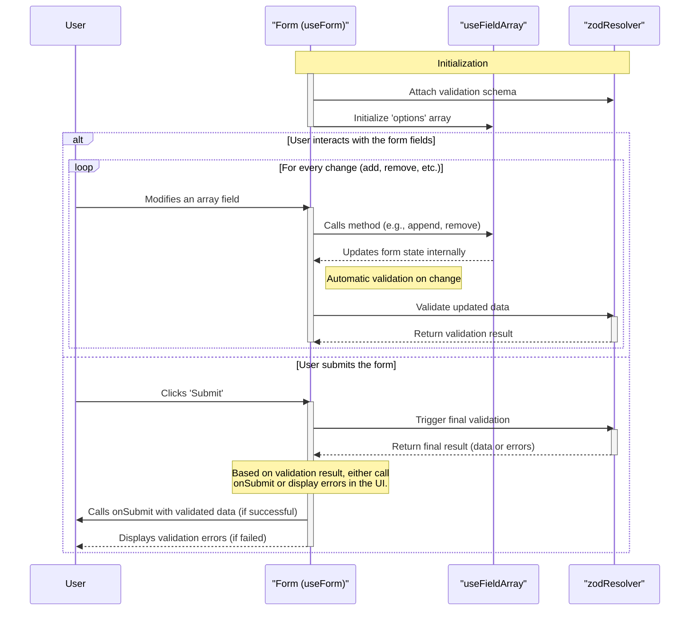
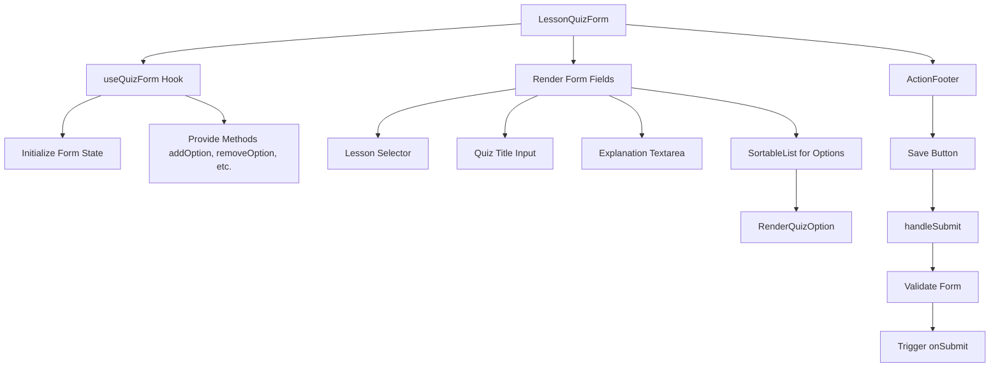
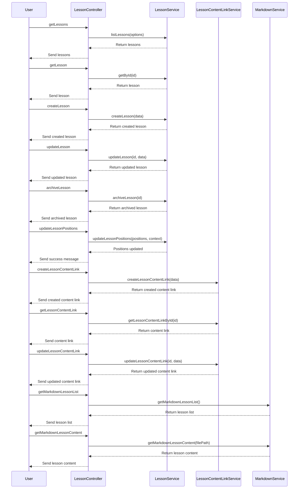

## Step 1: Start with Entities

### Enums used in the lesson entity

- `ELessonType` = Lesson types such as theory, quiz, and coding.
- `ELessonContentLinkType` = Link types for lesson content (e.g., markdown, video).

### Course

- Acts as the root entity.
- Has a `OneToMany` relationship with Module, Chapter, and Lesson.
- Represents the overall structure of a course.

### Module

- Belongs to a Course (`ManyToOne`).
- Contains multiple Chapters (`OneToMany`).
- Represents a logical grouping of chapters within a course.

### Chapter

- Belongs to both Module and Course (`ManyToOne`).
- Contains multiple Lessons (`OneToMany`).
- Represents a specific section within a module.

### Lesson

- Belongs to Chapter, Module, and Course (`ManyToOne`).
- Contains multiple LessonContentLinks and Quizzes (`OneToMany`).
- Represents the smallest unit of learning content.

### LessonContentLink

- Belongs to a Lesson (`ManyToOne`).
- Represents external resources or links associated with a lesson.

### Quiz

- Belongs to a Lesson (`ManyToOne`).
- Contains multiple QuizOptions (`OneToMany`).
- Represents assessments or questions related to a lesson.

### QuizOption

- Belongs to a Quiz (`ManyToOne`).
- Represents the possible answers for a quiz question.

### Visualization of Relationships

- The relationships are hierarchical, starting from Course and cascading down to QuizOption.
- Each entity has clear parent-child relationships, ensuring modularity and scalability.
- Foreign keys (`courseId`, `moduleId`, `chapterId`, etc.) are used to establish these relationships.



## Step 2: Lesson: Start with the UI and understand the logic

### UI Pages, Validations, and Types

- Create all the pages first for tab visualization for lesson management.
- Create 5 pages initially and use the admin layout for all the pages.
- Create all the validations and types for lesson management.
- Explain the validations and types.

:::warning
Before proceeding to the next step, ensure to build the project and verify that everything works as expected.
:::

### Lesson Creation: Start with a dropdown store

- In the lesson creation UI, we need dropdowns for course, module, and chapter. Selecting these repeatedly would result in a poor user experience. To improve this, we can use a dropdown store to keep track of the selected values and populate the dropdowns accordingly.
- Create a dropdown selection store with `selectedCourse`, `selectedModule`, `selectedChapter`, and their respective setters.
  - `selectedCourse`
  - `selectedModule`
  - `selectedChapter`
  - `selectedLesson`
- Create setters for the above states so that they can be used in the UI.

### Lesson Creation: Controller

- Fetch all the courses, modules, and chapters for the dropdowns and initialize them.
- Create the `useForm`.
- Create the `onSubmit` function.
- Add `useEffect` to set the modules and chapters based on the selected course and module, respectively.

### Lesson Creation: UI

- Use the controller hook.
- Add the form with all the fields one by one.
- Test the validation and the UI.

## Step 3: Lesson Content Create UI

### Markdown Viewer Component

- As our lesson content link will support markdown, we need a markdown viewer component.
- Let's install all the required packages.

```bash
npm install react-markdown remark-gfm prism-react-renderer mermaid github-markdown-css
```

- It will support Mermaid charts as well, so we install Mermaid too.
- Explain what's going on in the component, including the CSS.
- Show how to use that component with a sample markdown content.



### Lesson Content: Create Controller

- Create the `useForm` and the `onSubmit` function.
- Take state for the markdown content.

### Lesson Content: Create UI

- Use the controller hook.
- Add the form with all the fields one by one.
- Use the markdown viewer component to show a preview of the markdown content from the local state.
- Test the validation and the UI.

## Step 4: Quiz Create UI

### Quiz Creation: Create Controller

- Create the `useForm` and the `onSubmit` function.
- Take state for the quiz options as an array of objects.
- Create functions to add, remove, and update quiz options.



### useForm and useFields Array Explanation



### Lesson Quiz Form: Create UI



## Step 5: Lesson List UI

### Lesson List: Create Controller

- Fetch all the dropdown data and declare the state.
- Add all the methods for handling drag-and-drop, similar to other modules.

### Lesson List: Create UI

- Use the controller hook.
- Add the header form with all the fields one by one.
- Add the list with drag-and-drop support using the common drag-and-drop component.
- Test the validation and the UI.

## Step 6: Backend API development

### Services and Repositories

- Create all the repositories for lesson related entities.
- Lesson service, lessonContentLink service, Quiz service and markdown service.
- Explain all the services start from lesson - lessonContent - markdown - quiz service.

### Controllers & Routes

- Overview of controllers with services.
- Explain all the controllers with services.



#### Routes

- Add all the routes as serial.
- Add lesson router into the index router.
- Start adding validation of each route and create new validations schema as needed

## Step 7: API Binding with UI

### Endpoints & Query Hooks

- Add all the endpoints for lesson related entities here: `frontend/src/api/endpoints/lesson.ts`
- Add all the query hooks for lesson related entities here: `frontend/src/hooks/query/course/lesson.ts`

### Lesson Create API Bind

- add the mutation for create and update
- add the query for get lesson by id
- add the useEffect hook for fetching the lesson by id when in edit mode
- Add mutation into the onSubmit function for create and update
- Check and test the create and update functionality
- You will get error of validation schema mismatch, We should pass params validation not query validations

### Lesson Content Create/Edit API Bind

- Update useLessonContentLinkForm controller to add the mutation for create and update
- Add the query for get lesson data for dropdown
- Add useDropdownSelection for first selection those dropdowns form lesson page.
- Update the handleMarkdownFileChange function
- Update onSubmit function for create and update
- Update the return data from the hook, like isLoading and lessonData
- Update the lessonContentLinkForm component by adding the hooks value
- Update the Lesson Dropdown and its onChange function
- isLoading update
- Now test. If you get a validation schema mismatch error with the `.md` file regex, fix that in `packages/definitions/src/validations/lesson.ts`
- Test again and all should work fine.

### Lesson Quiz Create/Edit API Bind

- Update useLessonQuizForm controller to add the mutation for create and update
- Update useDropdownSelection for first selection those dropdowns form lesson page.
- Add the query for get lesson data for dropdown
- Add create and update mutation into the onSubmit function
- Update the onSubmit function for create and update
- Go to the LessonQuizForm component and add the hooks value
- Update the Lesson Dropdown and its onChange function
- Let's test the quiz form create and update functionality
- If you get an error, remove Id from validation of quizOptions
- Also add the position property in the quizOptions create while creating the quiz.

### Lesson List API Bind

- Update all the state for search, filter, archived
- Update the api call with queries
- Add mutation API for archive and position update
- Add the lesson list API query hook with all the query params
- Update `useEffect()` for update the lesson state
- Add `useEffect()` for fetching moduleList and chapterList when selectedCourse and selectedModule changes
- Add `useEffect()` for searchQuery
- Update saveChanges method for position update api call
- Update cancelChanges method and other methods
- update `confirmArchivedOperation()` method for archive api call
- Go to the list page component
- Update controller hooks return data
- Update all the loading value

### Refactor

- FE - Add enum in the Item component in the all the courseModule archived button logic
- BE - Add oneToMany fields in the course entity for quiz count
- BE - Add `loadRelationCountAndMap()` in the course service listCourses method
- FE - Module Header design fix responsiveness issue while dropdown increases
- FE - Added Favicons and icons and added meta tag information in the html head for SEO

### Final Testing

- Perform manual e2e testing for all the implemented features.
- Verify that all the UI components are functioning as expected.
- Ensure that all API bindings are working correctly and returning the expected results.
- Test the validation schemas thoroughly to ensure no mismatches occur.
- Check for any edge cases or scenarios that might break the application.
- Conduct cross-browser testing to ensure compatibility.
- Perform performance testing to identify and resolve any bottlenecks.
- Ensure that all the implemented features meet the project requirements and specifications.
