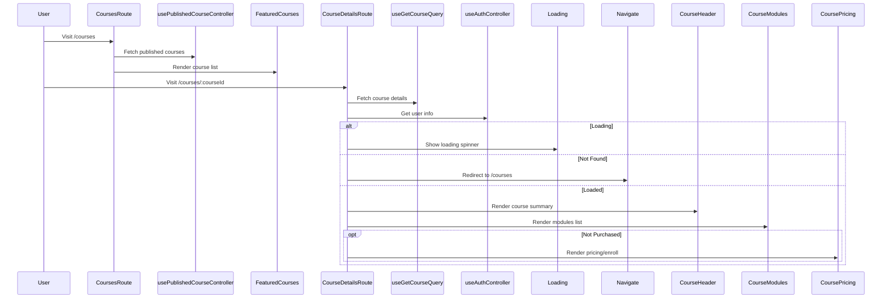

## Step 1: Home Page

### Components

```typescript
<Hero isAuthenticated={isAuthenticated} />
<FeaturedCourses courses={[]} />
<FaqSection />
<WhyChooseUs />
<CtaSection />
```

- Add each section component one by one.
- Add the Hero section and provide an explanation.
- Add the Featured Courses section and provide an explanation.
- Add the FAQ section and provide an explanation.
- Add the Why Choose Us section and provide an explanation.
- Add the CTA section and provide an explanation.
- Now test the UI.
- You can see that when logged in, you are still able to go to the sign-in page.
- Let's add a `beforeLoad()` method and logic to redirect if already signed in.
- Add the Featured Courses component to the `/courses` page as well.

### API Implementation

- Add `publicRoutes()` in the `backend/src/routes/course/course.ts` file.
- Explain the usage of controllers and services and where they are used.
- Add the route in the main route file: `backend/src/routes/index.ts`.

### API Binding

- Create endpoints for published courses.
- Add them to the query hook.
- Create a controller for published courses: `frontend/src/hooks/controller/course/usePublishedCourseController.ts`.
- Use that controller and the courses in the home page and course page.
- Test the home page and courses page.

## Step 2: Course Details Page

- Create a new page at `frontend/src/routes/(website)/_layout/courses/$courseId/index.tsx`
- Add the state needed, courseId from params, user from authController and course details from useGetCourseQuery
- Add a loading state and error state
- And if we not found the course, we will navigate to home page
- Three component we need to create
  - CourseHeader
  - CourseModules
    - ModuleCard
  - CoursePricing
- Create one by one and add the explanation
- Add real data while creating the components as we already called the query hook for getting the course details


