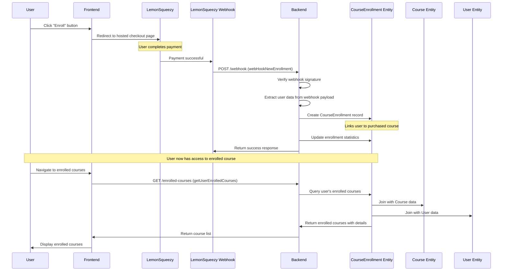
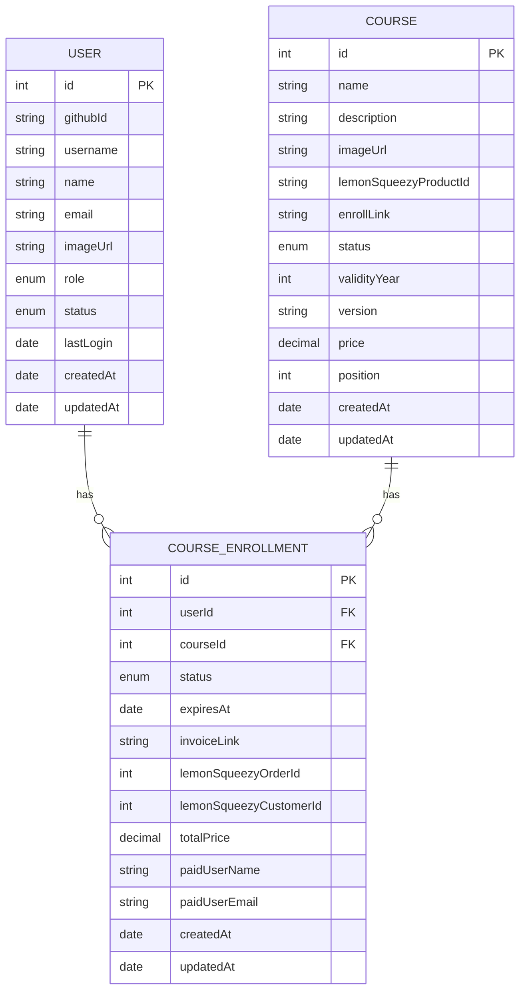

## Step 1: Frontend Implementation

- Create a hook that will handle the checkout link for LemonSqueezy: `frontend/src/hooks/controller/course/lemonSqueezyCheckoutUrl.ts`.
- Explain `urlString` and how it is used. The custom property will help identify the user and course during the webhook call from LemonSqueezy.
  ```typescript
  const urlString = `${enrollLink}?checkout[email]=${user.email}&checkout[custom][userId]=${user?.id}&checkout[custom][courseId]=${courseId}`;
  ```
- Update the course details page's enroll course button link to use this hook.
- Add the type `courseEnrollments` in `IUser` for future use, as it will provide the total count of enrolled courses for a user.
- Test the button functionality. That's it for the frontend part, as we are using LemonSqueezy's hosted checkout page.

## Step 2: Backend Implementation

### Visual Overview of the Process



### Entity Implementation



- A User can have many CourseEnrollment records.
- A Course can have many CourseEnrollment records.
- Each CourseEnrollment links a User to a Course (many-to-one in both directions).
- Create a repository for CourseEnrollment to use in the service.

### Types and Schemas

- Create the enum.
- Move the file from the validation folder to the types folder.
- Add the type `ILemonSqueezyOrderWebhook`.

### Services Implementation

- Create a service for CourseEnrollment.

- `enrollNewCourse(orderData)`:

  - Creates a new course enrollment using order data.
  - Validates `userId` and `courseId` from the order metadata.
  - Calculates `expiresAt` based on the course's validity period.
  - Saves enrollment details like status, invoiceLink, totalPrice, etc.

- `getUserEnrolledCourses(userId?)`:

  - Fetches active course enrollments for a specific user or all users.
  - Includes related course and user data.
  - Returns fields like `courseId`, `expiresAt`, `invoiceLink`, and `status`.

- `verifySignature(rawBody, signature)`:

  - Verifies the authenticity of a webhook request.
  - Compares the HMAC signature with the provided signature.
  - Ensures secure communication with LemonSqueezy.

### Controller and Routes

- Create the controller: `backend/src/controllers/course/courseEnrollment.ts`.
- In the `webHookNewEnrollment` method:
  - LemonSqueezy sends a POST request to our webhook endpoint when a payment is successful.
  - Parse the request `rawBody` to extract order details.
  - Create the `rawBodyVerifyConfig()` in `backend/src/config/rawBody.ts` and initialize it in the main app file. Explain it briefly.
  ```typescript
  // For raw body parsing in webhooks trigger verification - MUST BE FIRST before json parser
  this.app.use(rawBodyVerifyConfig());
  ```
  - Verify the request signature to ensure it's from LemonSqueezy using the `verifySignature()` method from the service.
  - If the signature is valid, extract the order data from the request body.
  - Call the `enrollNewCourse()` method from the service to create a new course enrollment.
  - Finally, send a success response back to LemonSqueezy.
- Another method `getUserEnrolledCourses()`:
  - Retrieves the list of courses a user is enrolled in.
  - Get the `userId` from the request parameters.
  - Call the `getUserEnrolledCourses()` method from the service to fetch the enrollments.
  - Send the list of enrolled courses as a JSON response.
- Create the routes for the controller methods: `backend/src/routes/course/courseEnrollment.ts`.
- Two routes are needed:
  - A public route for the webhook to handle new enrollments.
  - A private route to get the user's enrolled courses.
  - Create them and explain briefly.
- Add the enrolled courses count to the profile API so that the frontend can detect which courses the user is enrolled in easily.
  - Update the user entity with a `oneToMany` relation with the CourseEnrollment entity.
  - `IUser` was already updated during the frontend part.
  - Update the `UserService` - `getUserProfile()` method to include the count of `courseEnrollments`.
- Finally, add the routes to the main route file: `backend/src/routes/index.ts`:
  - `/webhooks/enrollment/new-enrollment`
  - `/api/learner/enrollment/courses`

## Step 3: Testing Enrollment

:::warning
Before testing, add the webhook endpoints in the LemonSqueezy dashboard. When completing an order on the checkout page, it will trigger our API `/webhooks/enrollment`.
As we are developing locally, use [ngrok](https://ngrok.com/) to expose your local server to the internet. Localhost won't work for LemonSqueezy webhooks.
:::

### ngrok Setup

- Create an account in ngrok.
- Download and install ngrok.
- Find the token and configure it.
- Run the following command to expose your local server (assuming your backend server runs on port 8000):
  ```bash
  ngrok http 8000
  ```

### Configure LemonSqueezy Webhook

- Copy the generated public URL (e.g., `https://abcd1234.ngrok.io`).
- Go to your LemonSqueezy dashboard.
- Navigate to the Webhooks section.
- Add a new webhook endpoint using the ngrok URL followed by `/webhooks/enrollment/new-enrollment`
  (e.g., `https://abcd1234.ngrok.io/webhooks/enrollment/new-enrollment`).
- Save the webhook configuration.

### Final Testing Steps

- Log in as a learner.
- Test the enrollment by purchasing a course through the frontend.
- After completing the purchase, check your backend server logs to see if the webhook was received and processed correctly.
- Verify that a new record is created in the `CourseEnrollment` table in your database.
- Check the user's profile to see if the enrolled courses count is updated correctly.
