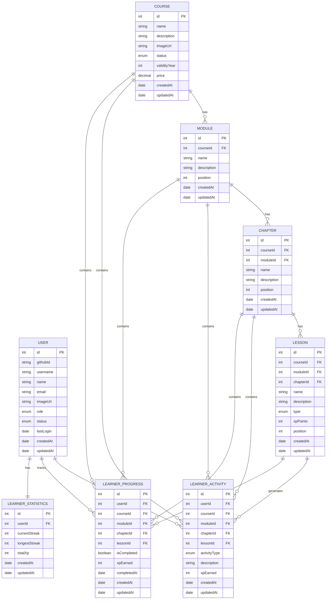
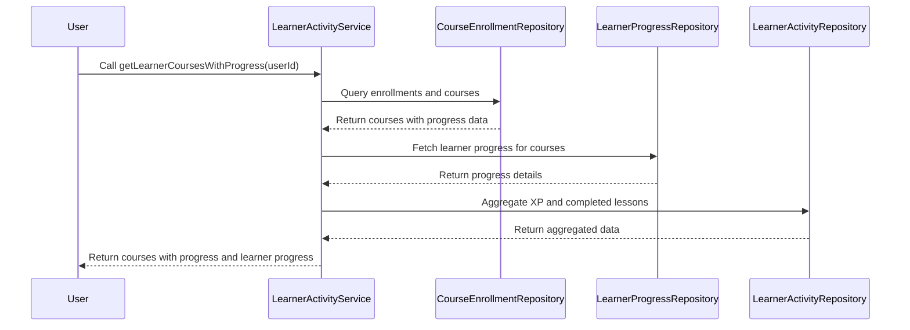
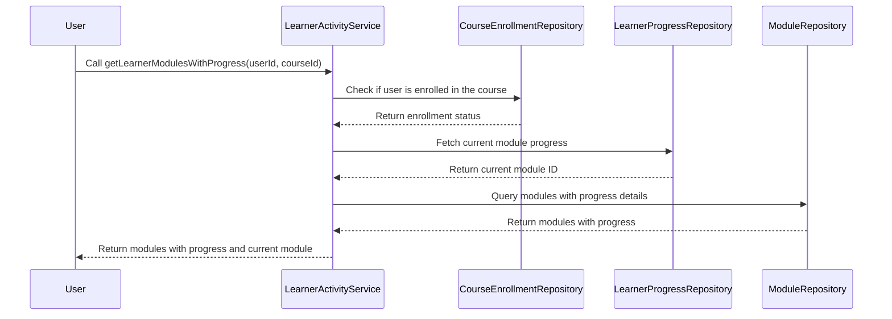
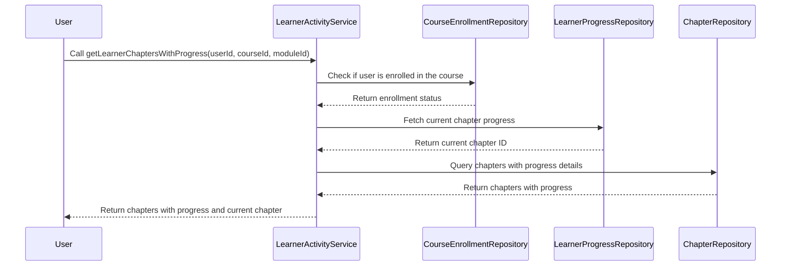
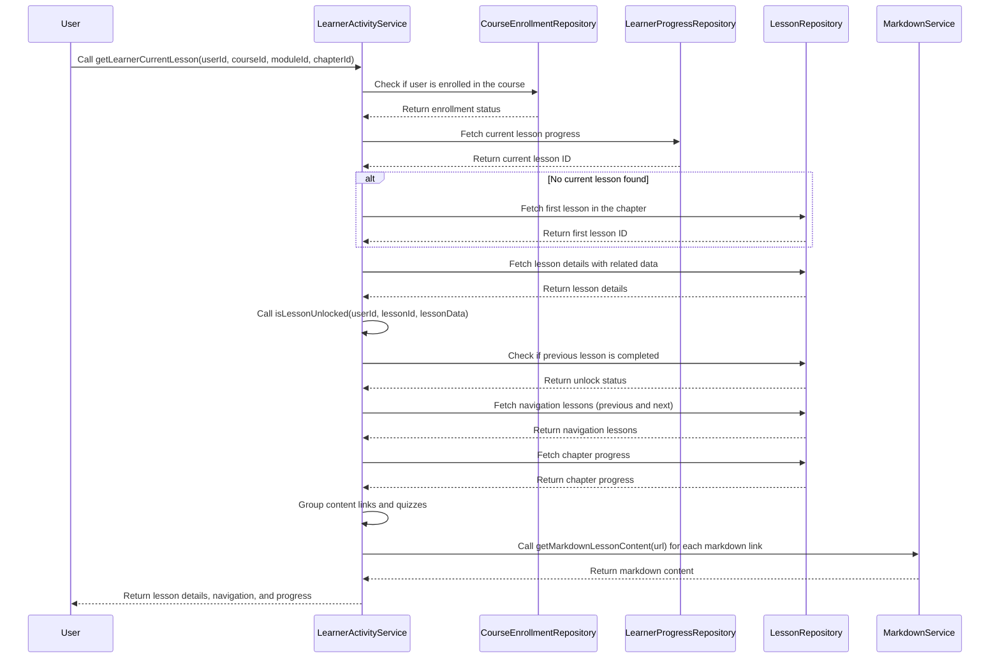
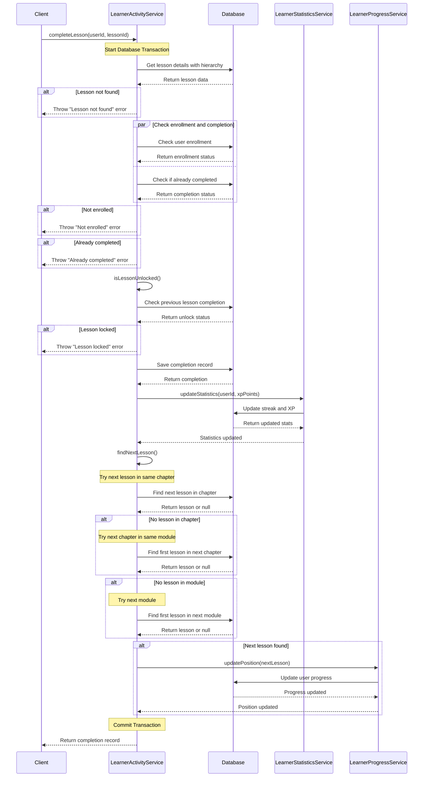
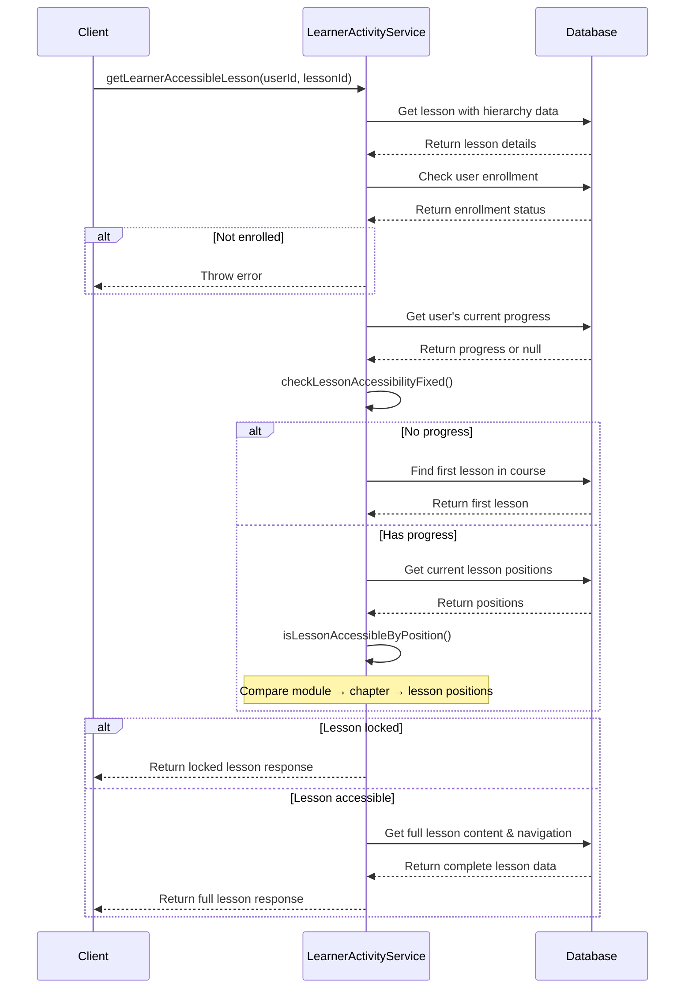

Our target is to track learner activities, progress, and statistics as they engage with courses. This involves creating entities to log activities, track lesson completions, and summarize overall progress. These are the features we will implement step by step:

- Learner Active Courses with progress
- Active modules for each course with progress
- Active chapters for each module with progress
- Active lessons for each chapter with progress

We will start with entity creation and then move to API and UI implementation for each feature.

## Step 1: Entity - Learning Tracking

### Entity and Repositories



- Each user has one LearnerStatistics record (overall progress summary).
- LearnerProgress tracks completion status for each lesson per user.
- LearnerActivity logs all user activities (lesson completions, quiz attempts, etc.).
- All progress and activity entities reference the course hierarchy (Course → Module → Chapter → Lesson).
- XP points flow from lessons through activities to statistics.
- Create repositories for each entity.

:::info
We will proceed feature by feature for now, as this is a complex feature to implement. We will tackle the backend and frontend features one at a time.
:::

## Step 2: Active Course with Progress Implementation

### Frontend: UI Implementation

- Create a new page in `frontend/src/routes/learner/_layout/courses/index.tsx`.
- We need two components: `LearnerInfoHeader` and `ActiveCourses`.
- Create `LearnerInfoHeader` and explain the code.
- Add the necessary type for future use.
- Create the `ActiveCourses` component and explain the code.
- Use `useAuthController` to get the user info and display it on the `LearnerInfoHeader` component.
- For courses? Let's work on the backend for that and come back later.
- Add dummy data for now to test the UI.
- That's it for the UI part for now. Let's move over to the backend part.

### Backend: Service Implementation

:::note
Initially, when we do not have any activity or progress, we will return the course list with 0% progress. In this case, we still need our entities to be present for that.
:::

- Create the service and the method for getting the active courses with progress.
- `LearnerActivityService` -> `getLearnerActiveCoursesWithProgress(userId: number)`.
- Here is the diagram:



- Explain the diagram.
- Why multiple tables are needed to get the data.
- Explain the code and logic.

### Backend: Controller and Routes

- Create the controller and add the method for our feature: `backend/src/services/learningProgress/learnerActivity.ts`.
- Create the route with only one route for now: `backend/src/routes/learningProgress/learnerActivity.ts`.
- Add the route to the main route: `backend/src/routes/index.ts`.

### Frontend: Bind API - Creating Endpoint and Query Hook

- Create the endpoint: `frontend/src/api/endpoints/learner.ts` - `getLearnerActiveCourses()`.
- Create the query hook: `frontend/src/hooks/query/course/learner.ts` - `useGetLearnerActiveCoursesQuery()`.

### Frontend: Bind API - Using the Query Hook to Update Component

- Update this component with the query hook: `frontend/src/routes/learner/_layout/courses/index.tsx`.
- Update the main component: `frontend/src/components/learner/course/activeCourses.tsx` for navigating to our next page, which will be the next feature - Active Modules with Progress that we will implement next.
- For this, we need the route to navigate. So, let's create that route now in `frontend/src/routes/learner/_layout/courses/$courseId/modules.tsx`.
- We are now good with the active courses with progress feature. Let's move to the next feature - Active Modules with Progress.

## Step 3: Module and Chapter List with Progress Implementation

### Backend: Service Implementation

#### `getLearnerModulesWithProgress()`



#### `getLearnerChaptersWithProgress()`



### Backend: Controller, Routes, and Validations

- Add two methods in `backend/src/controllers/learningProgress/learnerActivity.ts` controller file.
- Update the route file by adding two routes in `backend/src/routes/learningProgress/learnerActivity.ts`.
- Add some common parameter validations for retrieving info in `packages/definitions/src/validations/common.ts`.
- Use them in the routes file.

### Frontend: Endpoint and Query Hook

- After signing in, redirect to the `learner/courses` page.
- Create the endpoint: `frontend/src/api/endpoints/learner.ts`.
- Create the query hook: `frontend/src/hooks/query/course/learner.ts`.
- Update method names.
- When logging in, redirect to the active courses page instead of the profile page. Update the navbar and `useGithubCallbackController` file.

### Frontend: Update Component

- Create two pages: one for loading modules and another for loading chapters.
  - `frontend/src/routes/learner/_layout/courses/$courseId/modules.tsx`
  - `frontend/src/routes/learner/_layout/courses/$courseId/$moduleId/chapters.tsx`
- Call the query hook in these two pages to fetch the data.
- Create a list UI component and an item for the list item.

#### Progress Bar Component

- `frontend/src/components/learner/course/materialsProgress.tsx`.
- This will be used in both module and chapter list item components to show the progress bar.

#### Module Card Refactor

- Refactor the module card used on the website to make it a common component.
- Move it to `frontend/src/components/common/cards/moduleCard.tsx`.
- Add navigation logic in the component's `onClick` method.
- Explain the code.

#### Module List and Card Component Render

- Create a new component in the learner folder: `frontend/src/components/learner/course/courseModules.tsx`.
- Place the `materialsProgress` bar component and module card component to display the data.
- Create a helper function to identify which module is locked and which is not.
  - `frontend/src/utilities/helper/markAsLocked.ts`.
  - Explain why this is needed.
- Explain the code and logic.
- Use this component in the modules page created earlier.
- Pass the data through the `markAsLocked` function to modify the module data with locked true/false.
- Explain the `overallXpEarned` and `overallProgress` calculation logic.

#### Chapter List and Card Component Render

- Create the chapter card component: `frontend/src/components/common/cards/chapterCard.tsx`.
- Explain the code.
- Create the chapter list component: `frontend/src/components/learner/course/courseChapters.tsx`.
- Explain the code.
- Use this component in the chapters page created earlier.
- Pass the data through the `markAsLocked` function to modify the chapter data with locked true/false.
- Explain the `overallXpEarned` and `overallProgress` calculation logic.
- Test the UI to ensure it is working.

#### Fix the Website Module List Link When Clicked

- In `frontend/src/routes/(website)/_layout/courses/$courseId/index.tsx`, add the `moduleId`, `courseId`, and `isLearner` parameters to the link so that it navigates to the correct module page.
- Test to ensure it is working.

## Step 4: Current Lesson of a Chapter Implementation

### Backend: Service Implementation

- Here is the service method diagram for `getLearnerLessonsWithProgress()`:



### Backend: Controller and Routes

- Create the controller method in `backend/src/controllers/learningProgress/learnerActivity.ts` and add the method `getLearnerCurrentLesson()`.
- Create the route `/:courseId/modules/:moduleId/chapters/:chapterId/current-lesson` in `backend/src/routes/learningProgress/learnerActivity.ts`.

### Frontend: Endpoint, Query Hook, and Types

- `frontend/src/api/endpoints/learner.ts` - `getLearnerCurrentLessonApi()`.
- `frontend/src/hooks/query/course/learner.ts` - `useGetLearnerCurrentLessonQuery()`.
- `packages/definitions/src/types/lesson.ts` - `ICurrentLesson`.

### Frontend: Create Lesson Page and Component

- Create the route in `frontend/src/routes/learner/_layout/courses/$courseId/$moduleId/$chapterId/lesson.tsx`.
- Call the API query hook to get the data.
- Explain this as we are gonna use it little bit later let's add it for now.

```typescript
const search = Route.useSearch() as { lessonId?: string };
const lessonId = search.lessonId;
```

- Add necessary state management for the lesson page, including loading states.
- Create the following components for the lesson page:

#### Progress Bar Component

- `frontend/src/components/learner/lesson/progressBar.tsx`.
- This component is a common component that can be used elsewhere with circular or linear progress bars.

#### Stepper Component

- `frontend/src/components/learner/lesson/lessonStepper.tsx`.
- This component displays the stepper for a chapter's total lessons.
- Explain the code and logic.

#### Lesson Footer Fixed Bottom Component

- `frontend/src/components/learner/lesson/lessonFooter.tsx`.
- This component displays the footer with navigation and a "Mark as Complete" button.
- Include previous and next buttons for navigation.

#### Lesson Video Preview Component

- For video lesson content, create a video player component.
- Display YouTube videos using an iframe for now.
- `frontend/src/components/learner/lesson/lessonVideos.tsx`.

#### Markdown Viewer Component

- For displaying markdown content, create a markdown viewer component.
- Move the existing admin component to a common component: `frontend/src/components/common/markdown/markdownViewer.tsx`.

#### Quiz Component

- Create a quiz component for lesson content quizzes.
- `frontend/src/components/learner/lesson/quizSelection.tsx`.
- Explain the code and logic.

#### Main Lesson Component Update

- Add all the above components to the main lesson component.
- Add data props for future use.
- Explain the code and logic.
- Use the `frontend/src/routes/learner/_layout/courses/$courseId/$moduleId/$chapterId/lesson.tsx` page to include this component and pass the data.

#### Chapter Card Update

- Update the chapter card component to include navigation to the current lesson page: `frontend/src/components/common/cards/chapterCard.tsx`.
- Add future navigation options.
- Test the UI to ensure it is working.

## Step 5: Complete a Lesson

### Backend: API - Start with Service

- Create a service: `completeLesson()` and add other helper methods.
- It will require other services as well: `backend/src/services/learningProgress/learnerProgress.ts` and `backend/src/services/learningProgress/learnerStatistics.ts`.
- Explain each service and their relationships.



### Backend: Controller, Routes, and Types

- Add the `completeLesson()` controller in `backend/src/controllers/learningProgress/learnerActivity.ts`.
- Add the route for `completeLesson()` in `backend/src/routes/learningProgress/learnerActivity.ts`.

### Frontend: Endpoint and Query Hook

- Implement the `postLessonCompleteApi()` method in `frontend/src/api/endpoints/learner.ts`.
- Add the query hook `useLessonCompleteMutation()` in `frontend/src/hooks/query/course/learner.ts`.
- Explain query invalidation as well.

### Frontend: Component Changes

- Add the mutation for lesson completion, passing all the courseId, moduleId, and chapterId.
- Complete the `onCompleteHandler()` method for logic such as navigating to the next lesson, submitting the lesson, or handling cases where the lesson is already completed.
- Complete the `onPreviousHandler()` method for navigating to the previous lesson.
- Create the chapter-complete page for navigation and result observation.

## Step 6: Completed Lesson List Page

### Backend: API Implementation

- Create and explain the service: `backend/src/services/learningProgress/learnerActivity.ts`.
- Create and explain the controller: `backend/src/controllers/learningProgress/learnerActivity.ts`.
- Add the route in `backend/src/routes/learningProgress/learnerActivity.ts` and add validation.

### Frontend: API Endpoints and Hooks

- Add the endpoint `getCompletedLessonsApi()` in `frontend/src/api/endpoints/learner.ts`.
- Add the query hook `useGetCompletedLessonsQuery()` in `frontend/src/hooks/query/course/learner.ts`.
- Add the `ICompletedLesson` type for data usage in the lesson type file.

### Frontend: New Component and Old Component Update

- Create two new components for the completed list UI: the banner (`frontend/src/components/learner/lesson/completionBanner.tsx`) and the `completeLessons` component for showing the list UI and data. Add and explain them.
- Add both components and also add the data fetch query hook into the main component. Explain the whole page: `frontend/src/routes/learner/_layout/courses/$courseId/$moduleId/$chapterId/chapter-complete.tsx`.
- Now update the old component: `frontend/src/components/common/cards/chapterCard.tsx`. Add navigation when chapter progress is 100% so users can navigate to the completed lesson page and access any lesson.

## Step 7: Accessible Lesson API and Lesson Component Update

Currently, when we visit the lesson page, it shows the current ongoing lesson and does not display the exact lesson when lessons are completed. We need to create a similar API as we did for the current lesson earlier to find accessible lessons. When a lesson is completed, it becomes accessible and should be available for access. We will use the same page to display the lesson again. Since we added a query parameter with the lesson ID in the frontend, that will help identify which particular lesson we are accessing. Let's implement this.

### Backend: API Implementation - Service

- Add `getLearnerAccessibleLesson()`.
- Add helper methods: `checkLessonAccessibilityFixed()`, `isLessonAccessibleByPosition()`.



### Backend: Controller and Routes

- Add the `getLearnerAccessibleLesson()` controller in `backend/src/controllers/learningProgress/learnerActivity.ts`.
- Add the route for `getLearnerAccessibleLesson()` in `backend/src/routes/learningProgress/learnerActivity.ts` and add validation for the route.

### Frontend: Endpoints, Query Hook, and Component Update

- Add `getLearnerAccessibleLessonApi()` in `frontend/src/api/endpoints/learner.ts`.
- Add `useGetLearnerAccessibleLessonQuery()` in `frontend/src/hooks/query/course/learner.ts`.
- In `frontend/src/routes/learner/_layout/courses/$courseId/$moduleId/$chapterId/lesson.tsx`, since we already have the UI, update it so that when we get the lessonId from the search query, we fetch that particular lesson's data. Everything else will remain the same.
- Test the full functionality and review the results.

### Frontend: Refactor

- In `frontend/src/routes/learner/_layout/courses/$courseId/modules.tsx`, corrected the overallXpEarned calculation to display the accurate value. Also, explained why course progress may appear lower than module progress.
- Added a continue button to the active course component (`frontend/src/components/learner/course/activeCourses.tsx`) so users can easily navigate to their active lesson, improving the user experience.
- Fixed the progress bar label to show chapter progress instead of module progress in `frontend/src/components/learner/course/courseChapters.tsx`.
- Updated the `LessonContentForm` to remove the image option and add support for video lessons, since images can be included in markdown. Added video content to some lessons and tested the functionality.
- We are getting issue with the Video URL not loading initially, so let's fix that issue as well.
- Iframe fix `frontend/src/components/learner/lesson/lessonVideos.tsx`.
- Fix the `mainLesson` component conditional rendering markdown, video and quiz component rendering issue - `frontend/src/components/learner/lesson/mainLesson.tsx`.
- Test the full functionality and review the results.
- Finally, we are done with the learning tracking feature. We have implemented all the necessary features step by step. We can now track learner activities, progress, and statistics as they engage with courses. This will help us to provide a better learning experience for our users.
