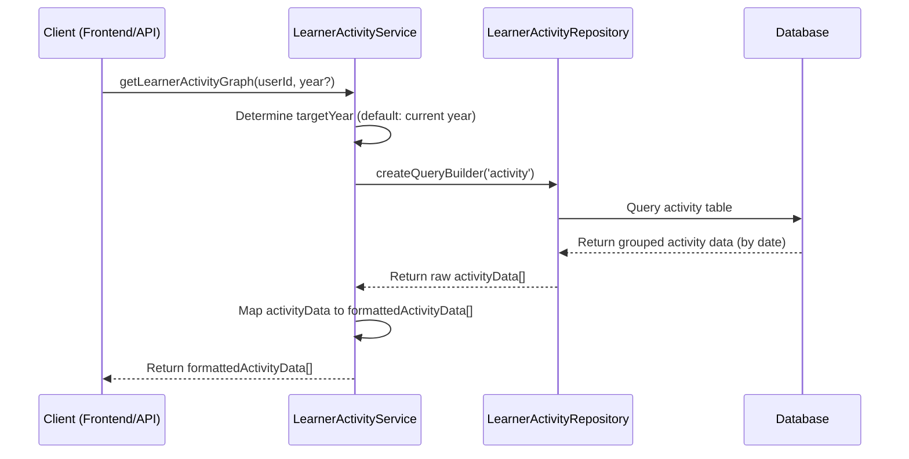
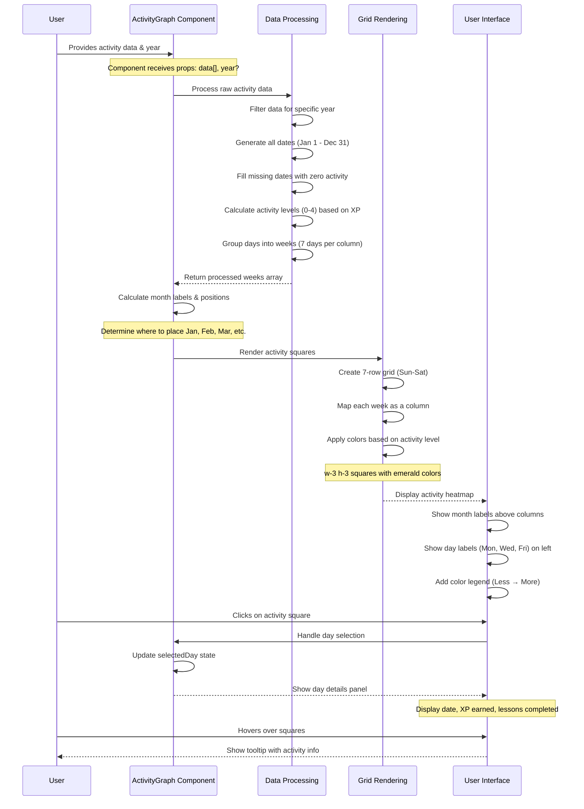

## Step 1: Learner Header Info Backend Implementation

### Backend

- Create a new service in `backend/src/services/learningProgress/learnerStatistics.ts`.
- Update `backend/src/services/account/user.ts` to include `learnerStatisticsService.getLearnerStatistics` and bind the information in the response body.

### Frontend

- Test the API and the frontend component to ensure the correct values are displayed in the `learnerInfoHeader` component.

## Step 2: Learner Activity Graph Backend Implementation

### Backend: API Implementation

- Create a new service in `backend/src/services/learningProgress/learnerActivity.ts` with the `getLearnerActivityGraph()` method. See the diagram below.

- Create a new controller in `backend/src/controllers/learningProgress/learnerActivity.ts` with the `getLearnerActivityGraph()` method.
- Add a new route in `backend/src/routes/learningProgress/learnerActivity.ts` to bind the controller method.
- No validation is needed, as it defaults to the current year if no year is provided.

### Frontend: Activity Graph Component

- Create the endpoint `getLearnerActivityGraphApi()` in `frontend/src/api/endpoints/learner.ts`.
- Create the type for the returned data named `IActivityGraph` in `packages/definitions/src/types/user.ts`.
- Create the query `useGetLearnerActivityGraphQuery()` in `frontend/src/hooks/query/course/learner.ts`.
- Before returning the data, modify it for the component:
  - Add the method `convertDatesWithTimezoneArray(dateString: string): Date` in `frontend/src/utilities/helper/convertDateWithTimezone.ts`.
  - This will convert the date string to the start of the day in the user's timezone.
  - Use it when returning the data in the query hook.
- Update older methods to invalidate queries when a user completes a lesson or earns XP. In the method `useLessonCompleteMutation()`:
  - Invalidate `PROFILE_KEYS.userData` so it refetches.
  - Invalidate `LEARNER_KEYS.leaderBoard` so it refetches.
- Create a new component `ActivityGraph` in `frontend/src/components/learner/course/activityGraph.tsx`.
- Explain the diagram as shown below.

- Add the query hook to fetch the data and pass it to the component.
- Add this component to the `frontend/src/routes/learner/_layout/courses/index.tsx` page.
- Test the UI by completing a lesson and verifying that the graph updates.
