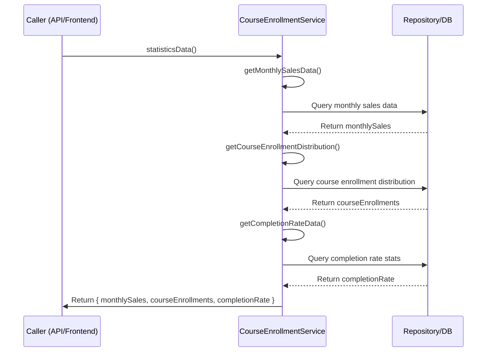

## Step 1: Dashboard Overview

### Backend Changes

- Create a new route using the existing router in `backend/src/routes/index.ts`.
- The API endpoint will be `/api/admin/learner-enrollment`.
- The service contains logic to determine admin or learner access based on `user.role`.
- Based on the role, it retrieves the appropriate data.
- For admin users, it will get all learners' information.
- That's it for the backend.

### Frontend: Endpoints and Query Hook

- Update the existing endpoint with a parameter called `isAdmin` in `frontend/src/api/endpoints/learner.ts` for the `getLearnerBillingSummaryApi()` method.
- Update the query hook in `frontend/src/hooks/query/course/learner.ts` named `useGetLearnerBillingSummaryQuery()`.
- Both will need the `isAdmin` parameter; if true, it will fetch data for all learners, otherwise, it will be accessible for a single learner.

### Frontend: Pages & Components

- Create a page in `frontend/src/routes/admin/_layout/dashboard/overview.tsx`.
- It will need a Table component (which we already have) and a `SummaryCards` component.
- First, call the API query hook. You will also need to modify the data to calculate the summary card information.
  - Create this function in `frontend/src/utilities/helper/adminStats.ts`.
  - The `getDashboardOverviewSummary()` function will look up and calculate the total sum of information from the list data.
- Use the list data in the table, and the summary card will display the total information.
- Create the summary card component in `frontend/src/components/admin/dashboard/summaryCards.tsx`.
- Use `useMemo` and the helper function to avoid recalculating every time the component re-renders.
- Prepare the table information with the existing component; it will require `ITableHeader`, so define that as well.
- Render both components and check the results.
- Test to ensure everything is displayed correctly.

## Step 2: Dashboard Statistics

### Backend: Services, Controller, and Routes

- Start by creating a new service in `backend/src/services/course/courseEnrollment.ts` named `statisticsData()`. This method also requires three helper methods for generating monthly sales, course enrollment distribution, and completion rate data.
- See the diagram below for an overview:

- Create the controller for this in `backend/src/controllers/course/courseEnrollment.ts`.
- Add the route in the existing router file. Since this is only for admin, add it to `backend/src/routes/account/user.ts` inside the `adminRoutes` method with `adminRouter`.
- Create the type in `packages/definitions/src/types/lesson.ts` as `IDashboardStatistics`.

### Frontend: Endpoints and Query Hook

- Add a new endpoint in `frontend/src/api/endpoints/learner.ts` named `getStatisticsDataApi()`.
- Add a new query hook in `frontend/src/hooks/query/course/learner.ts` named `useGetStatisticsDataQuery()`.
- Add the corresponding type as well.

### Frontend: UI Pages and Chart Components

- As we are going to render charts on this page, we need a chart library. We will use `recharts`, which provides all the chart features we need. Install it with `pnpm install recharts`.
- Create the route page in `frontend/src/routes/admin/_layout/dashboard/statistics.tsx`.
- Fetch the data using the query hook to ensure the correct data is returned.
- Create three components to display sales, enrollment, and completion rate charts:
  - `MonthlySalesChart`: create and explain it.
  - `CourseEnrollmentChart`: create and explain it.
  - `CompletionRateChart`: create and explain it.
- Add all the components to the main page and pass the data to them.
- Test the UI to ensure everything is working correctly.
